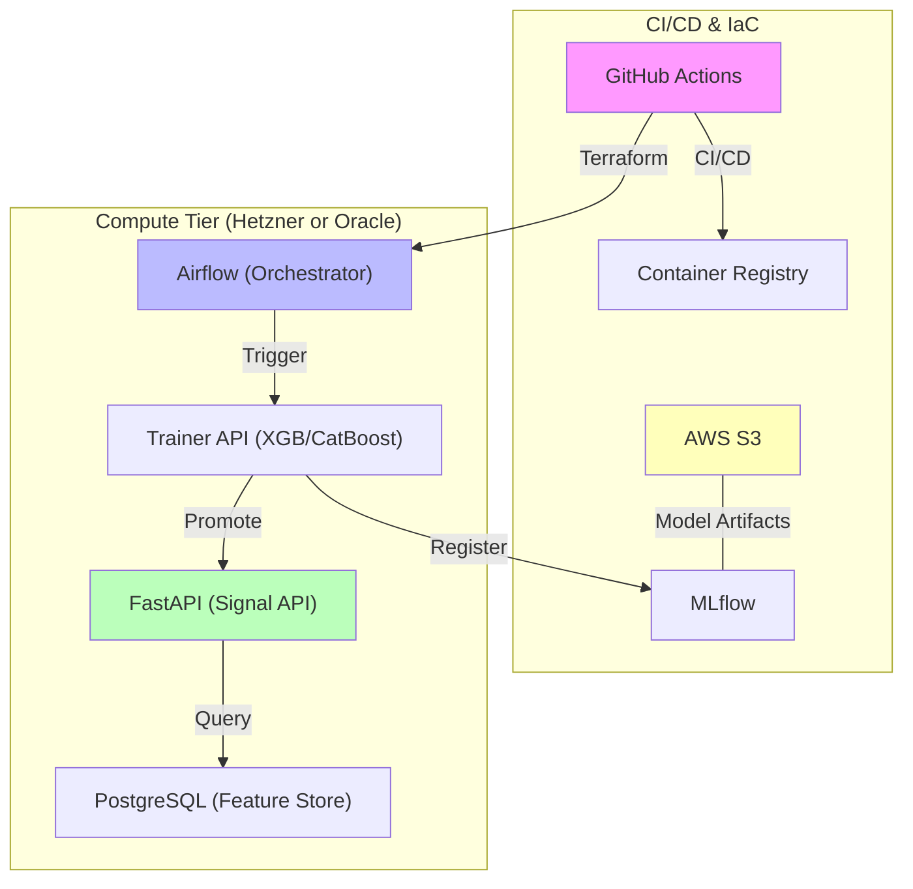

# AlphaPulse - Quantitative MLOps Platform

AlphaPulse is a **zero-cost MLOps infrastructure** designed for automated quantitative trading. It demonstrates professional expertise in **decoupled architecture**, **automated training loops**, and **Zero-Budget FinOps** (Oracle Always Free + AWS Free Tier).

---

## 🚀 Core MLOps Capabilities

### 1. Advanced Automated Training (CT)
- **Multi-Engine Iterative Search**: Evaluates **XGBoost**, **Random Forest**, and **CatBoost**. CatBoost is utilized for its superior handling of noisy financial data and native categorical feature support.
- **AutoML with Optuna**: Automated hyperparameter tuning using Bayesian Optimization to find the most robust model configurations.
- **Anti-Overfitting Gates**: Multi-layered protection using **Walk-Forward Cross-Validation** and strict Train-Validation gap thresholds.

### 2. Multi-Cloud FinOps Strategy
- **Zero-Cost Entry**: Architecture optimized for **Oracle Cloud Always Free (ARM64)**, providing 4 vCPUs and 24GB RAM at **$0/month**.
- **High-Performance Scaling**: Seamless failover to **Hetzner Cloud (CPX21)** for dedicated x86 performance and 99.9% SLA.
- **Hybrid Storage**: Uses **AWS S3** for durable model registry and backups, staying within the 5GB Free Tier.

### 3. Industrial Data Engineering
- **Feature Store**: Standardized **50+ stationary indicators** (Log Returns, RSI, Volatility Z-Scores) ensuring zero serving-skew.
- **Historical Scaling**: Integrated **8 years of real-time hourly BTC data** (73,000+ samples).

---

## 📊 System Architecture

---

## 🛠️ Technology Stack

- **ML Frameworks**: CatBoost, XGBoost, Scikit-learn, Optuna
- **Data Infrastructure**: Apache Airflow, PostgreSQL (Feature Store)
- **Observability**: Evidently AI, MLflow
- **Cloud/IaC**: Terraform, k3s (Kubernetes), Oracle Cloud, Hetzner, AWS

---

## 📚 Quick Links for Recruiters

- **[MLOps Engineering Report](docs/reports/MLOPS_ENGINEERING_REPORT.md)**: Deep-dive into architecture, shadow deployment, and feature store.
- **[System Validation Audit](docs/reports/SYSTEM_VALIDATION_AUDIT.md)**: Data quality, test coverage, and production readiness check.
- **[Advanced Anti-Overfitting Strategy](docs/training/TRAINER_IMPROVEMENTS.md)**: Technical details on model robustness.
- **[FinOps Strategy](docs/deployment/COST_FINOPS.md)**: How I optimized the stack to $11/month.

---

**Core Values**: **Cost Efficiency**, Financial Precision, Scalability, Security.