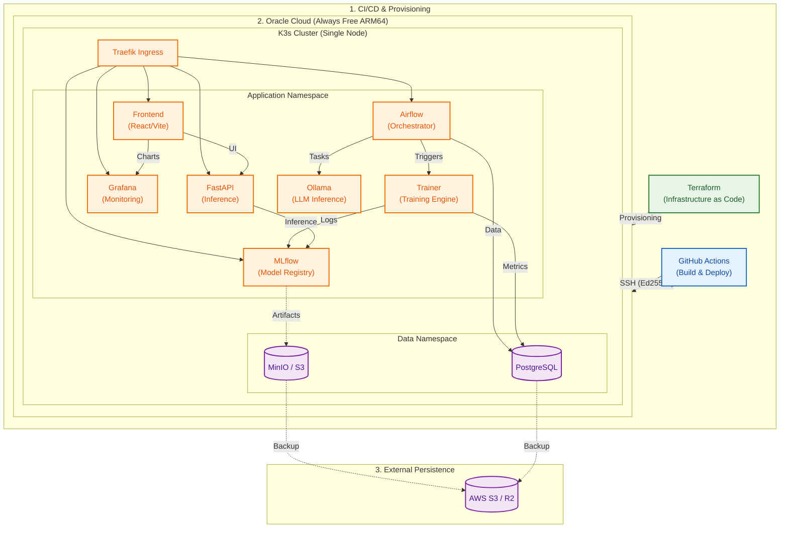
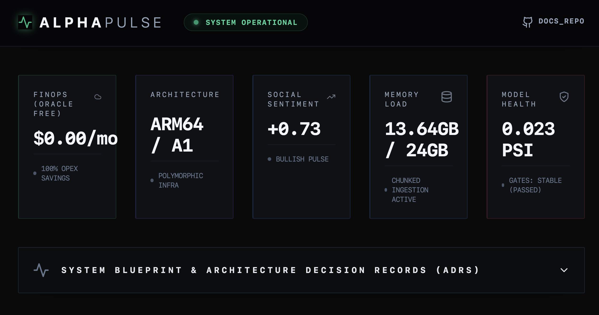

# AlphaPulse: Production-Grade MLOps for Crypto-Fintech

[](https://alphapulse.luichu.dev/)
[](docs/architecture/adr-007-cross-cloud-strategy.md)
[](docs/architecture/adr-008-cpu-first-optimization.md)
[](docs/deployment/COST_FINOPS.md)
[](src/alphapulse/data/processor.py)

AlphaPulse is a **Zero-Cost, High-Performance MLOps Platform** built for quantitative crypto trading. It bridges the gap between complex ML research and production-grade stability, optimized for **Oracle Cloud Always Free (ARM64)**.

> **🚀 Live Demo**: [https://alphapulse.luichu.dev/](https://alphapulse.luichu.dev/) (Deployed on Oracle Cloud + Cloudflare)

---

## 🏗️ System Architecture (Production)



---

## 📸 Platform Preview
> **🚀 Live Demo**: [https://alphapulse.luichu.dev/](https://alphapulse.luichu.dev/)



---

## 🛠️ Tech Stack & Tools

| Category | Technologies |
| :--- | :--- |
| **MLOps & Orchestration** | **Apache Airflow**, **MLflow**, **Docker**, **Kubernetes (k3s)**, **Terraform** |
| **Data Engineering** | **PostgreSQL**, **MinIO (S3 Compatible)**, **SQLAlchemy**, **Pydantic v2** |
| **Machine Learning & AI** | **CatBoost**, **Scikit-learn**, **LangChain**, **Ollama**, **Groq** |
| **Backend & API** | **Python 3.12**, **FastAPI**, **AsyncIO**, **Loguru** |
| **Frontend** | **React 18**, **TypeScript**, **Vite**, **Redux Toolkit**, **TailwindCSS**, **Recharts** |
| **DevOps & Quality** | **GitHub Actions** (CI/CD), **Pytest** (Cov), **Black** (Linting), **Traefik** |

---

## 🌟 Senior Engineering Highlights

### 1. Polymorphic Infrastructure (Cross-Cloud Strategy)
*   **Challenge**: Demonstrate senior-level cross-cloud capabilities without multi-cloud overhead or costs.
*   **Solution**: Implemented a **Provider-Agnostic Abstraction** layer using Terraform modules. The system defines a "Compute Module Interface," allowing seamless switching between **AWS EC2** and **GCP Compute Engine** via a single variable.
*   **Impact**: Achieve "Cloud Portability" with zero recurring costs.

### 2. High-Performance ETL & Data Engineering
*   **Challenge**: Processing **8+ years** of high-frequency market data on resource-constrained ARM64 instances (avoiding OOM).
*   **Solution**: Engineered resilient **Apache Airflow** DAGs with a **Chunked SQL Loading** and strict **Type Downcasting** strategy. Implemented **Pydantic** for rigorous schema validation and **SQLAlchemy** for ORM consistency.
*   **Impact**: Reduced memory footprint by **50%**, enabling full-history training on 24GB RAM without disk swapping.

### 3. Industrial-Grade Quality Assurance
*   **Multi-Stage CI/CD**: Enforced by GitHub Actions, featuring Unit Tests (Pytest), Integration Tests (DB/MLflow), and Smoke Tests.
*   **Fintech Precision**: AlphaPulse enforces `Decimal` types for all monetary values to prevent floating-point errors in trading simulations.
*   **Robustness**: Built-in **Anti-Overfitting Gates** and **Walk-Forward Cross-Validation** to ensure model reliability.

### 4. Professional Engineering Standards
*   **Type Safety**: 100% type-hinted codebase enforced by `mypy` and runtime validation via **Pydantic v2**.
*   **Modern Frontend**: Component-driven UI using React/Vite with strictly typed props and state management via Redux Toolkit.

---

## 💰 The FinOps Journey: $11/mo → $0/mo

AlphaPulse was engineered for extreme cost efficiency:
1.  **Phase 1 (AWS)**: Initial deployment on AWS EC2/RDS (~$11/mo).
2.  **Phase 2 (ARM64 Refactor)**: Re-engineered the training engine for ARM64 compatibility.
3.  **Phase 3 (Zero-Cost)**: Migrated the entire stack to **Oracle Cloud Always Free**. Hosting 4 vCPUs and 24GB RAM for **$0/month**.

---

## 🎯 Role-Specific Navigation

| If you are a... | Recommended Deep-Dives |
| :--- | :--- |
| **Hiring Manager** | **[Zero-Cost FinOps Strategy](docs/deployment/COST_FINOPS.md)** (Cost-conscious engineering) |
| **Technical Lead** | **[Architecture Principles](docs/architecture/README.md)** (Rationale behind k3s, CatBoost, and decoupling) |
| **DevOps Engineer** | **[CI/CD Workflow](.github/workflows/python-test-and-deploy.yml)** & **[k3s Setup](infra/k3s/base/)** |
| **ML Engineer** | **[Iterative Trainer Logic](src/alphapulse/ml/training/iterative_trainer.py)** (AutoML, Optuna, Feature Store) |

---

## 📂 Repository Structure
```text
alphapulse-mlops-platform/
├── .github/workflows/   # CI/CD Pipelines (Test, Build, Deploy)
├── airflow/             # ETL & Orchestration (DAGs, Plugins)
├── docs/                # Architecture Decision Records (ADRs) & Manuals
├── frontend/            # React/Vite UI for visualization
├── infra/               # Terraform (IaC) & Kubernetes Manifests
├── src/                 # Core Python Logic (Shared Library)
├── tests/               # Pytest Suite (Unit, Integration, E2E)
└── training/            # Standalone Training Scripts
```

---

## 🚀 Quick Start (Local Development)

### 📋 Prerequisites
*   **Docker & Docker Compose**
*   **Python 3.10+**
*   **Memory**: Min. 4GB RAM allocated to Docker.

### 🏃 Setup
```bash
# Clone the repository
git clone https://github.com/ChuLiYu/alphapulse-mlops-platform.git
cd alphapulse-mlops-platform

# Spin up Postgres, Airflow, MLflow, and API
./local_dev.sh up
```

### 🔍 Accessing Services
*   **Frontend UI**: `http://localhost:5173`
*   **Airflow**: `http://localhost:8080` (Default: `airflow/airflow`)
*   **MLflow**: `http://localhost:5000`
*   **API Docs**: `http://localhost:8000/docs`

---

## 📫 Connect
*   **LinkedIn**: [Li-Yu Chu](https://www.linkedin.com/in/chuliyu/)
*   **Email**: [liyu.chu.work@gmail.com](mailto:liyu.chu.work@gmail.com)
*   **Live App**: [alphapulse.luichu.dev](https://alphapulse.luichu.dev/)

---
**Core Values**: Financial Precision, Cost-Conscious Engineering, Architectural Decoupling.
**Technical Focus**: MLOps, DataOps, ETL, ELT, Data Pipeline, Feature Store, Model Registry, CI/CD for ML, Data Governance, Scalability, Observability, Cost Optimization, Infrastructure as Code (IaC), Monitoring, Alerting, Data Quality, Data Validation, Workflow Orchestration, Batch Processing, Real-time Processing, Data Lake, Data Warehouse.
**Fintech Domain**: Quantitative Trading, Algorithmic Trading, Risk Management, Backtesting, PnL Analysis, Financial Time-series, Technical Indicators, Sentiment Analysis, Market Data Engineering, Decimal Precision, Portfolio Management, Trading Strategy, Crypto-Fintech.