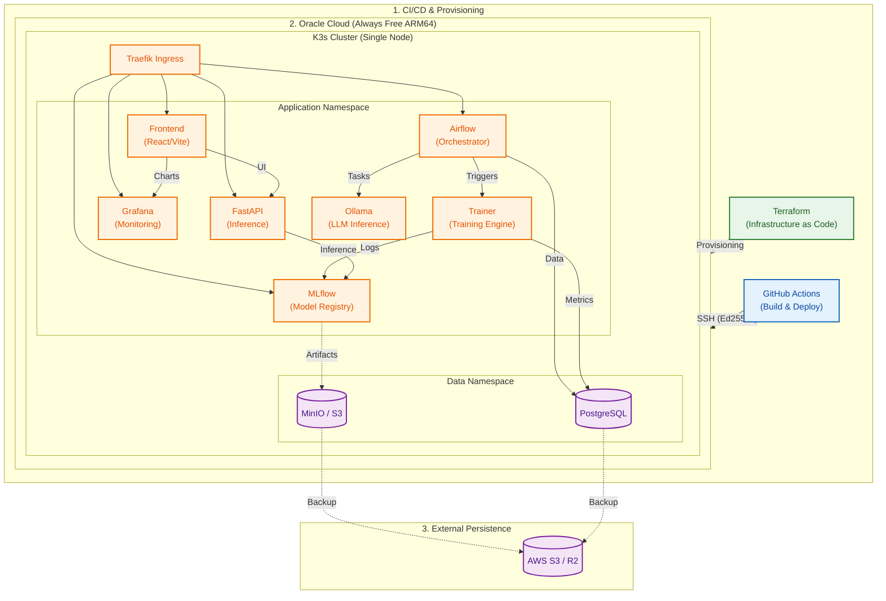
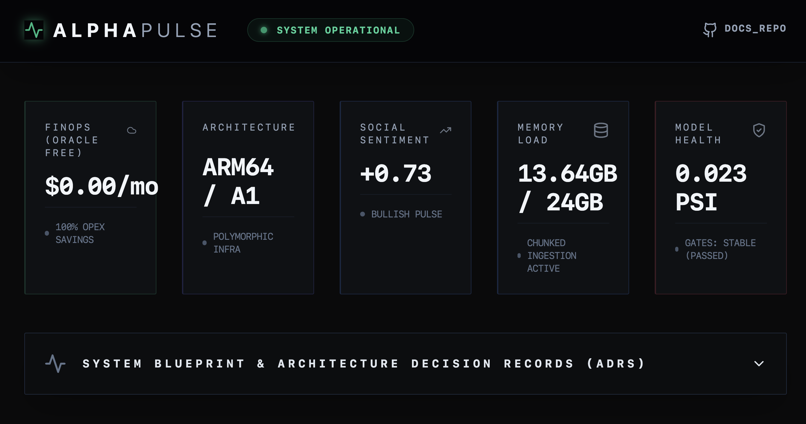

# AlphaPulse — Production-Grade DataOps & MLOps Platform

AlphaPulse is an end-to-end **DataOps & MLOps platform** engineered for financial market data —
featuring production-grade ELT pipelines, Medallion Architecture, financial-precision data
modeling, and cloud-agnostic infrastructure built with Terraform, Airflow, and Kubernetes.

Originally built as a zero-cost alternative to commercial data platforms, AlphaPulse demonstrates
how modern data engineering practices (dbt, Star Schema, SCD Type 2, data contracts, CI/CD for
data) can be applied to high-frequency financial time-series across multiple asset classes
(Equities & Crypto).

[](https://alphapulse.luichu.dev/)
[](docs/architecture/adr-007-cross-cloud-strategy.md)
[](docs/architecture/adr-008-cpu-first-optimization.md)
[](docs/deployment/COST_FINOPS.md)
[](src/alphapulse/data/processor.py)

> **📅 Current Status (Mar 2026)**: Phase 5 In Progress - K3s Cluster Migration

> **🚀 Live Demo**: [https://alphapulse.luichu.dev/](https://alphapulse.luichu.dev/) (Deployed on Oracle Cloud + Cloudflare)

---

## 🌿 Git Branch Strategy — Dual Portfolio

This repo maintains a **dual-branch portfolio strategy** to showcase both Data Engineering depth and full-stack MLOps capabilities:

| Branch | Purpose | Services | Target Audience |
|--------|---------|----------|-----------------|
| **`main`** | Lightweight DE Portfolio | Postgres, MinIO, Airflow, Frontend | Data Engineering roles |
| **`feature/mlops-full-stack`** | Full MLOps Platform | All services (FastAPI, Trainer, Grafana, Ollama, MLflow) | MLOps / Platform Engineer roles |

### Quick Switch

```bash
# Data Engineering focus (main)
git checkout main

# Full MLOps showcase
git checkout feature/mlops-full-stack
```

### K3s Deployment Note

Both branches include K3s manifests. The `main` branch has **replicas: 0** for heavy services (FastAPI, Trainer, Grafana), while `feature/mlops-full-stack` runs the full stack.

---

## 🏗️ System Architecture (Production)


```mermaid
%%{init: {'flowchart': {'curve': 'basis'}}}%%
flowchart TD
    %% --- Styles ---
    classDef ci fill:#E3F2FD,stroke:#1565C0,stroke-width:2px,color:#0D47A1;
    classDef infra fill:#E8F5E9,stroke:#2E7D32,stroke-width:2px,color:#1B5E20;
    classDef k8s fill:#FFF3E0,stroke:#EF6C00,stroke-width:2px,color:#E65100;
    classDef storage fill:#F3E5F5,stroke:#7B1FA2,stroke-width:2px,color:#4A148C;

    %% --- 1. CI/CD & Infra Layer ---
    subgraph CICD ["1. CI/CD & Provisioning"]
        direction TB
        TF["Terraform<br/>(Infrastructure as Code)"]:::infra
        GHA["GitHub Actions<br/>(Build & Deploy)"]:::ci
        TF ~~~ GHA
        GHA -- "SSH (Ed25519)" --> PROD
        TF -- "Provisioning" --> PROD
    end

    %% --- 2. Production Cluster (Oracle Cloud) ---
    subgraph PROD ["2. Oracle Cloud (Always Free ARM64)"]
        direction TB
        subgraph K3S ["K3s Cluster (Single Node)"]
            direction TB
            ING[Traefik Ingress]:::k8s
            subgraph Apps ["Application Namespace"]
                AF["Airflow<br/>(Orchestrator)"]:::k8s
                ML["MLflow<br/>(Model Registry)"]:::k8s
                API["FastAPI<br/>(Inference)"]:::k8s
                WEB["Frontend<br/>(React/Vite)"]:::k8s
                GF["Grafana<br/>(Monitoring)"]:::k8s
                TR["Trainer<br/>(Training Engine)"]:::k8s
                OL["Ollama<br/>(LLM Inference)"]:::k8s
            end
            subgraph Data ["Data Namespace"]
                 PG[(PostgreSQL)]:::storage
                 MI[(MinIO / S3)]:::storage
            end
        end
    end

    %% --- 3. External Storage ---
    subgraph EXT ["3. External Persistence"]
        direction LR
        S3[("AWS S3 / R2")]:::storage
    end

    %% --- Flows ---
    ING --> WEB
    ING --> AF
    ING --> ML
    ING --> GF
    ING --> API
    AF -- "Triggers" --> TR
    AF -- "Data" --> PG
    AF -- "Tasks" --> OL
    TR -- "Logs" --> ML
    TR -- "Metrics" --> PG
    API -- "Inference" --> ML
    WEB -- "UI" --> API
    WEB -- "Charts" --> GF
    ML -.->|Artifacts| MI
    MI -.->|Backup| S3
    PG -.->|Backup| S3
```

> **Demo Mode:** Only the K3s Frontend pod is running ($0/month).
> Full stack restores in under 5 minutes with `kubectl apply -k infra/k3s/base/`.

---

## 📸 Platform Preview
> **🚀 Live Demo**: [https://alphapulse.luichu.dev/](https://alphapulse.luichu.dev/)



---

## 🛠️ Tech Stack & Tools

| Category | Technologies |
| :--- | :--- |
| **MLOps & Orchestration** | **Apache Airflow**, **MLflow**, **Docker**, **Kubernetes (k3s)**, **Terraform** |
| **Data Engineering** | **PostgreSQL**, **MinIO (S3 Compatible)**, **SQLAlchemy**, **Pydantic v2** |
| **Machine Learning & AI** | **CatBoost**, **Scikit-learn**, **LangChain**, **Ollama**, **Groq** |
| **Backend & API** | **Python 3.12**, **FastAPI**, **AsyncIO**, **Loguru** |
| **Frontend** | **React 18**, **TypeScript**, **Vite**, **Redux Toolkit**, **TailwindCSS**, **Recharts** |
| **DevOps & Quality** | **GitHub Actions** (CI/CD), **Pytest** (Cov), **Black** (Linting), **Traefik** |

---

## 🏛️ Data Architecture — Medallion Design {#medallion}

| Layer  | Storage         | Responsibility                                  |
|--------|-----------------|-------------------------------------------------|
| Bronze | MinIO / Raw PG  | Immutable raw data — append only, audit trail   |
| Silver | PostgreSQL stg_ | Cleaned, typed, anomaly-filtered via dbt        |
| Gold   | PostgreSQL fct_ | Star Schema fact/dim tables for ML & Analytics  |

**Idempotency:** All Airflow tasks use `INSERT ... ON CONFLICT DO UPDATE` (UPSERT) — safe retries with zero duplicate data risk.

### Audit Trail — SCD Type 2 on dim_assets

WealthTech systems cannot overwrite historical dimension data — regulatory compliance requires a full audit trail. AlphaPulse implements **Slowly Changing Dimension Type 2** via dbt snapshots on `dim_assets`:

| Scenario                      | Without SCD Type 2 | With SCD Type 2         |
| ----------------------------- | ------------------ | ----------------------- |
| ETF risk changes Low → Medium | History lost       | Both versions preserved |
| Historical PnL attribution    | Incorrect          | Accurate                |
| Regulatory audit              | Cannot reconstruct | Full trail available    |

`dbt_valid_from` / `dbt_valid_to` enable point-in-time queries: accurate PnL calculation using the risk classification active at any given date.

---

## 🌟 Senior Engineering Highlights

### 1. High-Performance Data Engineering & ELT Pipeline

**Challenge:** Ingesting and processing 8+ years of high-frequency multi-asset market data on resource-constrained ARM64 instances without OOM failures.

**Solution:**

- Production Apache Airflow DAGs with **Chunked SQL Loading** and **Type Downcasting**, reducing memory footprint by 50%
- **Medallion Architecture** (Bronze → Silver → Gold): MinIO (raw) → PostgreSQL (validated) → dbt (feature marts & Star Schema reporting layer)
- **Pydantic v2** as a Data Contract layer — strict schema validation at every pipeline boundary
- **dbt tests** as automated Data Quality gates at each Medallion layer

**Impact:** Full 8-year history processed on 24GB RAM. Transparent data lineage from raw API response to ML-ready feature table.

**Keywords:** ELT, Medallion Architecture, Data Modeling, Airflow DAG, Data Contract, Data Lineage, Idempotency, dbt

### 2. Financial Data Precision & Data Quality

**Challenge:** Floating-point errors in trading simulations directly cause incorrect PnL reporting — unacceptable in any production financial system.

**Solution:**

- **`Decimal` types** for all monetary values platform-wide (Python `Decimal` + PostgreSQL `NUMERIC(20,8)`) — matching industry standards for financial data systems
- **Pydantic v2** runtime validation as a lightweight Data Contract at ingestion boundary
- **SCD Type 2** on `dim_assets` via dbt snapshots — preserving full audit trail of risk level changes for accurate historical PnL attribution
- **Walk-Forward Cross-Validation** and Anti-Overfitting Gates to prevent look-ahead bias

**Keywords:** Financial Precision, Data Integrity, Data Quality, Data Contracts, Zero Floating-Point Error, SCD Type 2, Audit Trail, Schema Validation

### 3. Zero-Cost FinOps & Cloud-Agnostic Infrastructure

**The FinOps Journey:** AWS EC2/RDS (~$11/mo) → ARM64 Refactor → Oracle Cloud Always Free ($0/mo)

**Solution:**

- **Provider-Agnostic Terraform abstraction layer** — migrate from OCI to AWS EKS or GCP GKE by changing a single variable. OCI is purely a zero-cost FinOps sandbox.
- Full stack (4 vCPUs, 24GB RAM, K3s, Airflow, MLflow) at **$0/month**
- Terraform modules enforce consistent resource tagging for cost attribution

**Keywords:** FinOps, IaC, Terraform, Cloud-Agnostic, Cost Optimization, ARM64

### 4. MLOps & Model Orchestration

> ML is a downstream consumer of the data platform — not the platform itself.

- **MLflow** for experiment tracking, model registry, and artifact versioning
- **Iterative Trainer** with Optuna hyperparameter search and Walk-Forward CV
- **Evidently AI** for production data drift monitoring
- Multi-model ensemble: CatBoost, XGBoost, LightGBM, Scikit-learn

**Keywords:** MLOps, Model Registry, Feature Store, Experiment Tracking, Data Drift

---

## 💰 The FinOps Journey: $11/mo → $0/mo

AlphaPulse was engineered for extreme cost efficiency:
1.  **Phase 1 (AWS)**: Initial deployment on AWS EC2/RDS (~$11/mo).
2.  **Phase 2 (ARM64 Refactor)**: Re-engineered the training engine for ARM64 compatibility.
3.  **Phase 3 (Zero-Cost)**: Migrated the entire stack to **Oracle Cloud Always Free**. Hosting 4 vCPUs and 24GB RAM for **$0/month**.

---

## 🎯 Role-Specific Navigation

| If you are a...       | Start here                                                                                           |
| --------------------- | ---------------------------------------------------------------------------------------------------- |
| **Hiring Manager**    | [FinOps Journey](#finops) · [Architecture](#architecture)                                            |
| **Data Engineer**     | [Medallion Architecture](#medallion) · [dbt Models](./dbt/) · [Airflow DAGs](./airflow/)             |
| **Data Analyst**      | [Star Schema](./dbt/models/marts/) · [Live Dashboard](https://alphapulse.luichu.dev/)                |
| **Platform / DevOps** | [Terraform IaC](./infra/terraform/) · [K3s Setup](./infra/k3s/) · [CI/CD](./.github/workflows/)      |
| **ML Engineer**       | [Iterative Trainer](./training/) · [MLflow Registry](./docs/) · [Feature Store](./dbt/models/marts/) |

---

## 📂 Repository Structure
```text
alphapulse-mlops-platform/
├── .github/workflows/   # CI/CD Pipelines (Test, Build, Deploy)
├── airflow/             # ETL & Orchestration (DAGs, Plugins)
├── docs/                # Architecture Decision Records (ADRs) & Manuals
├── frontend/            # React/Vite UI for visualization
├── infra/               # Terraform (IaC) & Kubernetes Manifests
├── src/                 # Core Python Logic (Shared Library)
├── tests/               # Pytest Suite (Unit, Integration, E2E)
└── training/            # Standalone Training Scripts
```

---

## 🚀 Quick Start (Local Development)

### 📋 Prerequisites
*   **Docker & Docker Compose**
*   **Python 3.10+**
*   **Memory**: Min. 4GB RAM allocated to Docker.

### 🏃 Setup
```bash
# Clone the repository
git clone https://github.com/ChuLiYu/alphapulse-mlops-platform.git
cd alphapulse-mlops-platform

# Spin up Postgres, Airflow, MLflow, and API
./local_dev.sh up
```

### 🔍 Accessing Services
*   **Frontend UI**: `http://localhost:5173`
*   **Airflow**: `http://localhost:8080` (Default: `airflow/airflow`)
*   **MLflow**: `http://localhost:5000`
*   **API Docs**: `http://localhost:8000/docs`

---

## 📫 Connect
*   **LinkedIn**: [Li-Yu Chu](https://www.linkedin.com/in/chuliyu/)
*   **Email**: [liyu.chu.work@gmail.com](mailto:liyu.chu.work@gmail.com)
*   **Live App**: [alphapulse.luichu.dev](https://alphapulse.luichu.dev/)

---
---

## ⚠️ Known Limitations & Technical Debt

### Production Limitations
- **Single-Node K3s**: Production uses single-node cluster without HA
- **Demo Mode Fallback**: Frontend relies on mock data when backend is offline
- **Synchronous DB Sessions**: Partial code uses sync SQLAlchemy Session

### Frontend Improvements Needed
- React Router installed but multi-page routing not fully implemented
- Redux Toolkit installed but not extensively used (mainly local state)
- Some feature directories (`features/auth/`, `features/market/`, `features/signals/`) are empty

### Backend Improvements Needed
- Health metrics endpoint (`/health/metrics`) needs: uptime, memory, CPU, connection tracking
- Alerting system (Slack/Email) not yet integrated with drift detection

---

## 🚧 Development Status

| Component | Status |
|-----------|--------|
| Backend API (FastAPI) | ✅ Stable |
| Frontend (React) | ✅ Stable (Demo mode available) |
| ML Training Pipeline | ✅ Stable |
| Docker Compose (Local) | ✅ Stable |
| K3s Deployment | 🔄 In Progress |
| Production Monitoring | 🔄 Improving |

---

**Core Values**: Financial Precision, Cost-Conscious Engineering, Architectural Decoupling.
**Technical Focus**: MLOps, DataOps, ETL, ELT, Data Pipeline, Feature Store, Model Registry, CI/CD for ML, Data Governance, Scalability, Observability, Cost Optimization, Infrastructure as Code (IaC), Monitoring, Alerting, Data Quality, Data Validation, Workflow Orchestration, Batch Processing, Real-time Processing, Data Lake, Data Warehouse.
**Fintech Domain**: Quantitative Trading, Algorithmic Trading, Risk Management, Backtesting, PnL Analysis, Financial Time-series, Technical Indicators, Sentiment Analysis, Market Data Engineering, Decimal Precision, Portfolio Management, Trading Strategy, Crypto-Fintech.
