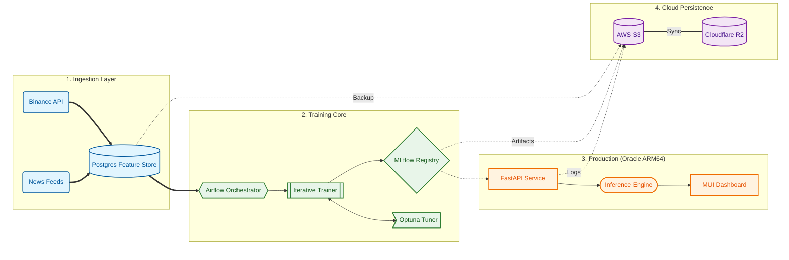

# AlphaPulse: Production-Grade MLOps for Crypto-Fintech

[](docs/architecture/adr-007-cross-cloud-strategy.md)
[](docs/architecture/adr-008-cpu-first-optimization.md)
[](docs/deployment/COST_FINOPS.md)
[](src/alphapulse/data/processor.py)

AlphaPulse is a **Zero-Cost, High-Performance MLOps Platform** built for quantitative crypto trading. It bridges the gap between complex ML research and production-grade stability, optimized for **Oracle Cloud Always Free (ARM64)**.

---

## 🏗️ System Architecture (Polymorphic & Decoupled)



---

## 🌟 Senior Engineering Highlights

### 1. Polymorphic Infrastructure (Cross-Cloud Strategy)
*   **Challenge**: Demonstrate senior-level cross-cloud capabilities without multi-cloud overhead or costs.
*   **Solution**: Implemented a **Provider-Agnostic Abstraction** layer using Terraform modules. The system defines a "Compute Module Interface," allowing seamless switching between **AWS EC2** and **GCP Compute Engine** via a single variable.
*   **Impact**: Achieve "Cloud Portability" with zero recurring costs.
*   **Reference**: [ADR-007: Cross-Cloud Abstraction](docs/architecture/adr-007-cross-cloud-strategy.md)

### 2. Memory-Optimized ML Pipeline (Edge Efficiency)
*   **Challenge**: Training high-dimensional models on resource-constrained ARM64 instances (avoiding OOM).
*   **Solution**: Developed a **Chunked Loading + Type Downcasting** strategy. Reduced memory footprint by **50%** by downcasting `float64` to `float32` and implementing chunked SQL ingestion.
*   **Impact**: Enables training on 8+ years of BTC hourly data on a single 24GB RAM instance without disk swapping.
*   **Reference**: [ADR-008: Memory-Optimization](docs/architecture/adr-008-memory-optimization-strategy.md)

### 3. Industrial-Grade Quality Assurance
*   **Multi-Stage CI/CD**: Enforced by GitHub Actions, featuring Unit Tests (Pytest), Integration Tests (DB/MLflow), and Smoke Tests.
*   **Fintech Precision**: Unlike generic templates, AlphaPulse enforces `Decimal` types for all monetary values to prevent floating-point errors in trading simulations.
*   **Robustness**: Built-in **Anti-Overfitting Gates** and **Walk-Forward Cross-Validation** to ensure model reliability in volatile markets.

---

## 💰 The FinOps Journey: $11/mo → $0/mo

AlphaPulse was engineered for extreme cost efficiency:
1.  **Phase 1 (AWS)**: Initial deployment on AWS EC2/RDS (~$11/mo).
2.  **Phase 2 (ARM64 Refactor)**: Re-engineered the training engine for ARM64 compatibility.
3.  **Phase 3 (Zero-Cost)**: Migrated the entire stack to **Oracle Cloud Always Free**. Hosting 4 vCPUs and 24GB RAM for **$0/month**.

---

## 🎯 Role-Specific Navigation

| If you are a... | Recommended Deep-Dives |
| :--- | :--- |
| **Hiring Manager** | **[Zero-Cost FinOps Strategy](docs/deployment/COST_FINOPS.md)** (Cost-conscious engineering) |
| **Technical Lead** | **[Architecture ADRs](docs/architecture/ADR_SUMMARY.md)** (Rationale behind k3s, CatBoost, and decoupling) |
| **DevOps Engineer** | **[CI/CD Workflow](.github/workflows/python-test-and-deploy.yml)** & **[k3s Setup](infra/k3s/base/)** |
| **ML Engineer** | **[Iterative Trainer Logic](src/alphapulse/ml/training/iterative_trainer.py)** (AutoML, Optuna, Feature Store) |

---

## 🚀 Quick Start (Local Development)

AlphaPulse is optimized for developer ergonomics. Start the entire local stack with one command:

```bash
# Spin up Postgres, Airflow, MLflow, and API
./dev.sh up
```

---
**Core Values**: Financial Precision, Cost-Conscious Engineering, Architectural Decoupling.
