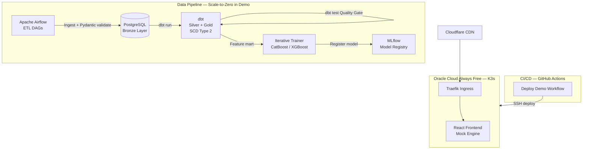

# AlphaPulse — WealthTech DE Refactor Prompt v2.0

> **給 AI Agent 的完整執行文檔**
> 整合所有重構、擴展與 Demo 任務。按 Part 順序執行，每個 Task 完成後輸出變更摘要。
> **禁止跳過任何 Definition of Done 檢查項目。**

---

## 🧭 總覽

### 目標定位

> **"Production-Grade DataOps & MLOps Platform for Financial Market Data"**

核心敘事轉變：

- ❌ 舊：「會架 ML 平台的工程師，用 Crypto 當題材」
- ✅ 新：「懂金融數據嚴謹性的 Data Engineer，ML 是數據平台的下游產出」

### 目標公司

Wealthsimple · Questrade · Neo Financial · CI Direct Investing

### 不需要改的東西

- 核心程式碼架構、Terraform、K3s 配置
- FinOps 故事（$11/mo → $0/mo）
- Pydantic v2 / Decimal 精度設計
- CI/CD GitHub Actions 主流程

### 執行優先順序

| Part   | 內容                         | 預估時間 | 優先級  |
| ------ | ---------------------------- | -------- | ------- |
| Part 1 | README 重新定位              | 1 天     | 🔴 立刻 |
| Part 2 | dbt Medallion + Data Quality | 3 天     | 🔴 立刻 |
| Part 3 | SCD Type 2 (dbt snapshot)    | 1 天     | 🟡 之後 |
| Part 4 | Star Schema 命名規範         | 0.5 天   | 🟡 之後 |
| Part 5 | Hero Demo Mock Mode          | 2 天     | 🟡 之後 |
| Part 6 | 截圖 / 架構圖                | 0.5 天   | 🟢 最後 |

---

---

# Part 1：README 重新定位

> **原則：不改一行業務邏輯，只改敘事角度。**

---

## Task 1｜更新 README 標題與 Description

**目標檔案**：`README.md`

將最頂部內容替換為：

```markdown
# AlphaPulse — Production-Grade DataOps & MLOps Platform

AlphaPulse is an end-to-end **DataOps & MLOps platform** engineered for financial market data —
featuring production-grade ELT pipelines, Medallion Architecture, financial-precision data
modeling, and cloud-agnostic infrastructure built with Terraform, Airflow, and Kubernetes.

Originally built as a zero-cost alternative to commercial data platforms, AlphaPulse demonstrates
how modern data engineering practices (dbt, Star Schema, SCD Type 2, data contracts, CI/CD for
data) can be applied to high-frequency financial time-series across multiple asset classes
(Equities & Crypto).

🚀 Live Demo: https://alphapulse.luichu.dev/
📐 Architecture: [See below](#architecture)
```

**規則**：

- 移除所有 "quantitative crypto trading" 表述，改為 "financial market data" 或 "multi-asset market data"
- 移除主標題中的 "MLOps Platform"，改為 "DataOps & MLOps Platform"

---

## Task 2｜重排 Highlights 順序

**目標檔案**：`README.md`

將 `🌟 Senior Engineering Highlights` 改為以下排序與內容：

### Highlight 1：High-Performance Data Engineering & ELT Pipeline

```markdown
### 1. High-Performance Data Engineering & ELT Pipeline

**Challenge:** Ingesting and processing 8+ years of high-frequency multi-asset market data
on resource-constrained ARM64 instances without OOM failures.

**Solution:**

- Production Apache Airflow DAGs with **Chunked SQL Loading** and **Type Downcasting**,
  reducing memory footprint by 50%
- **Medallion Architecture** (Bronze → Silver → Gold): MinIO (raw) → PostgreSQL (validated)
  → dbt (feature marts & Star Schema reporting layer)
- **Pydantic v2** as a Data Contract layer — strict schema validation at every pipeline boundary
- **dbt tests** as automated Data Quality gates at each Medallion layer

**Impact:** Full 8-year history processed on 24GB RAM. Transparent data lineage from
raw API response to ML-ready feature table.

**Keywords:** ELT, Medallion Architecture, Data Modeling, Airflow DAG, Data Contract,
Data Lineage, Idempotency, dbt
```

### Highlight 2：Financial Data Precision & Data Quality

```markdown
### 2. Financial Data Precision & Data Quality

**Challenge:** Floating-point errors in trading simulations directly cause incorrect PnL
reporting — unacceptable in any production financial system.

**Solution:**

- **`Decimal` types** for all monetary values platform-wide (Python `Decimal` +
  PostgreSQL `NUMERIC(20,8)`) — matching industry standards for financial data systems
- **Pydantic v2** runtime validation as a lightweight Data Contract at ingestion boundary
- **SCD Type 2** on `dim_assets` via dbt snapshots — preserving full audit trail of
  risk level changes for accurate historical PnL attribution
- **Walk-Forward Cross-Validation** and Anti-Overfitting Gates to prevent look-ahead bias

**Keywords:** Financial Precision, Data Integrity, Data Quality, Data Contracts,
Zero Floating-Point Error, SCD Type 2, Audit Trail, Schema Validation
```

### Highlight 3：Zero-Cost FinOps & Cloud-Agnostic Infrastructure

```markdown
### 3. Zero-Cost FinOps & Cloud-Agnostic Infrastructure

**The FinOps Journey:** AWS EC2/RDS (~$11/mo) → ARM64 Refactor → Oracle Cloud Always Free ($0/mo)

**Solution:**

- **Provider-Agnostic Terraform abstraction layer** — migrate from OCI to AWS EKS or
  GCP GKE by changing a single variable. OCI is purely a zero-cost FinOps sandbox.
- Full stack (4 vCPUs, 24GB RAM, K3s, Airflow, MLflow) at **$0/month**
- Terraform modules enforce consistent resource tagging for cost attribution

**Keywords:** FinOps, IaC, Terraform, Cloud-Agnostic, Cost Optimization, ARM64
```

### Highlight 4：MLOps & Model Orchestration（放最後）

```markdown
### 4. MLOps & Model Orchestration

> ML is a downstream consumer of the data platform — not the platform itself.

- **MLflow** for experiment tracking, model registry, and artifact versioning
- **Iterative Trainer** with Optuna hyperparameter search and Walk-Forward CV
- **Evidently AI** for production data drift monitoring
- Multi-model ensemble: CatBoost, XGBoost, LightGBM, Scikit-learn

**Keywords:** MLOps, Model Registry, Feature Store, Experiment Tracking, Data Drift
```

---

## Task 3｜更新 Role-Specific Navigation 表格

```markdown
## 🎯 Role-Specific Navigation

| If you are a...       | Start here                                                                                           |
| --------------------- | ---------------------------------------------------------------------------------------------------- |
| **Hiring Manager**    | [FinOps Journey](#finops) · [Architecture](#architecture)                                            |
| **Data Engineer**     | [Medallion Architecture](#medallion) · [dbt Models](./dbt/) · [Airflow DAGs](./airflow/)             |
| **Data Analyst**      | [Star Schema](./dbt/models/marts/) · [Live Dashboard](https://alphapulse.luichu.dev/)                |
| **Platform / DevOps** | [Terraform IaC](./infra/terraform/) · [K3s Setup](./infra/k3s/) · [CI/CD](./.github/workflows/)      |
| **ML Engineer**       | [Iterative Trainer](./training/) · [MLflow Registry](./docs/) · [Feature Store](./dbt/models/marts/) |
```

---

## ✅ Part 1 完成標準

- [ ] README 標題不含 "crypto trading" 或 "MLOps Platform" 作為主標籤
- [ ] Highlights 排序：Data Pipeline 第一，ML 最後
- [ ] Role Navigation 表格已更新，DE 排第二行

---

---

# Part 2：dbt Medallion Architecture + Data Quality

---

## Task 4｜建立 dbt 目錄結構

**目標**：在專案根目錄建立 `dbt/` 資料夾，完整結構如下：

```
dbt/
├── dbt_project.yml
├── profiles.yml.example
├── models/
│   ├── sources.yml                          # Bronze 層定義
│   ├── staging/                             # Silver 層
│   │   ├── stg_ohlcv.sql
│   │   ├── stg_trading_signals.sql
│   │   └── schema.yml
│   └── marts/                               # Gold 層
│       ├── fct_market_trades.sql            # Fact Table
│       ├── dim_assets.sql                   # Dimension Table
│       ├── fct_signal_performance.sql
│       └── schema.yml
├── snapshots/
│   └── dim_assets_snapshot.sql              # SCD Type 2（Part 3）
├── tests/
│   └── assert_no_negative_price.sql
├── macros/
│   └── financial_precision.sql
└── README.md
```

---

## Task 5｜dbt 設定檔

**`dbt/dbt_project.yml`**：

```yaml
name: "alphapulse"
version: "1.0.0"
config-version: 2
profile: "alphapulse"
model-paths: ["models"]
test-paths: ["tests"]
snapshot-paths: ["snapshots"]
macro-paths: ["macros"]

models:
  alphapulse:
    staging:
      materialized: view
      tags: ["silver", "staging"]
    marts:
      materialized: table
      tags: ["gold", "mart"]
```

**`dbt/profiles.yml.example`**：

```yaml
alphapulse:
  target: dev
  outputs:
    dev:
      type: postgres
      host: localhost
      port: 5432
      user: "{{ env_var('POSTGRES_USER', 'alphapulse') }}"
      password: "{{ env_var('POSTGRES_PASSWORD') }}"
      dbname: alphapulse
      schema: dbt_dev
      threads: 4
```

---

## Task 6｜Bronze 層 Source 定義

**`dbt/models/sources.yml`**：

```yaml
version: 2

sources:
  - name: raw
    description: "Bronze layer — raw market data ingested by Airflow. Append-only, never modified."
    schema: public
    tables:
      - name: prices
        description: "Raw OHLCV data from market data APIs"
        columns:
          - name: id
            tests: [unique, not_null]
          - name: symbol
            tests: [not_null]
          - name: close_price
            tests: [not_null]
          - name: timestamp
            tests: [not_null]

      - name: trading_signals
        description: "Raw model prediction signals"
        columns:
          - name: id
            tests: [unique, not_null]
          - name: signal_direction
            tests:
              - not_null
              - accepted_values:
                  values: ["LONG", "SHORT", "HOLD"]
```

---

## Task 7｜Silver 層 Staging Models

**`dbt/models/staging/stg_ohlcv.sql`**：

```sql
-- Silver Layer: Cleaned & typed OHLCV data
-- Enforces NUMERIC precision, removes anomalies, standardises timestamps

with source as (
    select * from {{ source('raw', 'prices') }}
),

cleaned as (
    select
        id,
        upper(symbol)                             as symbol,
        timestamp::timestamptz                    as price_timestamp,
        open_price::numeric(20, 8)                as open_price,
        high_price::numeric(20, 8)                as high_price,
        low_price::numeric(20, 8)                 as low_price,
        close_price::numeric(20, 8)               as close_price,
        volume::numeric(30, 8)                    as volume,
        current_timestamp                         as _loaded_at
    from source
    where close_price > 0           -- Anomaly filter: no negative/zero prices
      and volume >= 0               -- Anomaly filter: no negative volume
      and high_price >= low_price   -- OHLCV integrity check
      and open_price > 0
)

select * from cleaned
```

**`dbt/models/staging/stg_trading_signals.sql`**：

```sql
-- Silver Layer: Cleaned trading signals

with source as (
    select * from {{ source('raw', 'trading_signals') }}
),

cleaned as (
    select
        id,
        upper(symbol)                             as symbol,
        signal_direction,
        confidence_score::numeric(5, 4)           as confidence_score,
        predicted_price::numeric(20, 8)           as predicted_price,
        model_name,
        model_version,
        created_at::timestamptz                   as signal_timestamp,
        current_timestamp                         as _loaded_at
    from source
    where confidence_score between 0 and 1
      and predicted_price > 0
)

select * from cleaned
```

**`dbt/models/staging/schema.yml`**：

```yaml
version: 2

models:
  - name: stg_ohlcv
    description: "Silver: Cleaned, typed, anomaly-filtered OHLCV data"
    columns:
      - name: id
        tests: [unique, not_null]
      - name: symbol
        tests: [not_null]
      - name: close_price
        tests: [not_null]
      - name: price_timestamp
        tests: [not_null]
      - name: high_price
        tests: [not_null]
      - name: low_price
        tests: [not_null]

  - name: stg_trading_signals
    description: "Silver: Cleaned trading signals with validated confidence scores"
    columns:
      - name: id
        tests: [unique, not_null]
      - name: signal_direction
        tests:
          - accepted_values:
              values: ["LONG", "SHORT", "HOLD"]
      - name: confidence_score
        tests: [not_null]
```

---

## Task 8｜Gold 層 Star Schema Mart Models

**`dbt/models/marts/dim_assets.sql`**：

```sql
-- Gold Layer — Dimension Table: Asset master data
-- Note: SCD Type 2 history is handled via dbt snapshot (see snapshots/)

with assets as (
    select distinct
        symbol,
        case
            when symbol in ('BTC-USD', 'ETH-USD', 'SOL-USD') then 'Crypto'
            when symbol in ('SPY', 'QQQ', 'VTI')             then 'ETF'
            when symbol like '%-USD'                          then 'FX'
            else 'Equity'
        end                                                   as asset_class,
        case
            when symbol in ('BTC-USD', 'ETH-USD')            then 'High'
            when symbol in ('SPY', 'QQQ')                    then 'Low'
            else 'Medium'
        end                                                   as risk_level,
        min(price_timestamp)                                  as first_seen_at,
        current_timestamp                                     as _loaded_at
    from {{ ref('stg_ohlcv') }}
    group by symbol
)

select
    {{ dbt_utils.generate_surrogate_key(['symbol']) }}        as asset_key,
    symbol,
    asset_class,
    risk_level,
    first_seen_at,
    _loaded_at
from assets
```

**`dbt/models/marts/fct_market_trades.sql`**：

```sql
-- Gold Layer — Fact Table: One row per OHLCV candle
-- Conforms to Star Schema: joined with dim_assets via asset_key

with ohlcv as (
    select * from {{ ref('stg_ohlcv') }}
),

assets as (
    select * from {{ ref('dim_assets') }}
),

features as (
    select
        o.id,
        o.symbol,
        o.price_timestamp,
        o.open_price,
        o.high_price,
        o.low_price,
        o.close_price,
        o.volume,

        -- 1-day & 7-day returns (NUMERIC precision enforced)
        round(
            (o.close_price - lag(o.close_price, 1) over w)
            / nullif(lag(o.close_price, 1) over w, 0), 8
        )                                                     as return_1d,

        round(
            (o.close_price - lag(o.close_price, 7) over w)
            / nullif(lag(o.close_price, 7) over w, 0), 8
        )                                                     as return_7d,

        -- 30-day volatility proxy
        round(
            stddev(o.close_price) over (
                partition by o.symbol
                order by o.price_timestamp
                rows between 29 preceding and current row
            ), 8
        )                                                     as volatility_30d,

        -- 7-day avg volume
        round(
            avg(o.volume) over (
                partition by o.symbol
                order by o.price_timestamp
                rows between 6 preceding and current row
            ), 2
        )                                                     as avg_volume_7d,

        current_timestamp                                     as _loaded_at

    from ohlcv o
    window w as (partition by o.symbol order by o.price_timestamp)
)

select
    f.*,
    a.asset_key,
    a.asset_class,
    a.risk_level
from features f
left join assets a using (symbol)
where f.return_1d is not null
```

**`dbt/models/marts/fct_signal_performance.sql`**：

```sql
-- Gold Layer — Fact Table: Signal performance attribution

with signals as (
    select * from {{ ref('stg_trading_signals') }}
),

prices as (
    select symbol, price_timestamp, close_price
    from {{ ref('stg_ohlcv') }}
),

attributed as (
    select
        s.id                                                  as signal_id,
        s.symbol,
        s.signal_direction,
        s.confidence_score,
        s.predicted_price,
        s.model_name,
        s.model_version,
        s.signal_timestamp,
        p.close_price                                         as actual_price_at_signal,
        round(
            (p.close_price - s.predicted_price)
            / nullif(s.predicted_price, 0), 6
        )                                                     as prediction_error_pct,
        current_timestamp                                     as _loaded_at
    from signals s
    left join prices p
        on s.symbol = p.symbol
        and date_trunc('minute', s.signal_timestamp)
            = date_trunc('minute', p.price_timestamp)
)

select * from attributed
```

**`dbt/models/marts/schema.yml`**：

```yaml
version: 2

models:
  - name: dim_assets
    description: "Gold: Asset dimension table with risk classification"
    columns:
      - name: asset_key
        tests: [unique, not_null]
      - name: symbol
        tests: [unique, not_null]
      - name: asset_class
        tests:
          - accepted_values:
              values: ["Crypto", "ETF", "Equity", "FX"]
      - name: risk_level
        tests:
          - accepted_values:
              values: ["Low", "Medium", "High"]

  - name: fct_market_trades
    description: "Gold: OHLCV fact table with rolling features, joined to dim_assets"
    columns:
      - name: id
        tests: [unique, not_null]
      - name: close_price
        tests: [not_null]
      - name: asset_key
        tests: [not_null]

  - name: fct_signal_performance
    description: "Gold: Signal performance attribution for backtesting analysis"
    columns:
      - name: signal_id
        tests: [unique, not_null]
```

---

## Task 9｜自訂 Data Quality Tests

**`dbt/tests/assert_no_negative_price.sql`**：

```sql
-- Custom dbt test: All prices must be positive
-- Returns rows that FAIL (dbt convention)

select id, symbol, close_price, price_timestamp,
    'close_price must be > 0' as failure_reason
from {{ ref('stg_ohlcv') }}
where close_price <= 0

union all

select id, symbol, high_price, price_timestamp,
    'high_price must be >= low_price'
from {{ ref('stg_ohlcv') }}
where high_price < low_price
```

**`dbt/tests/assert_signal_confidence_range.sql`**：

```sql
-- Custom dbt test: Confidence score must be between 0 and 1

select id, symbol, confidence_score, signal_timestamp,
    'confidence_score must be between 0 and 1' as failure_reason
from {{ ref('stg_trading_signals') }}
where confidence_score < 0 or confidence_score > 1
```

---

## Task 10｜更新 Airflow DAG — 加入 dbt 步驟

在現有 ETL DAG 的最後，串接 dbt run + dbt test：

```python
from airflow.operators.bash import BashOperator

DBT_DIR = '/opt/airflow/dbt'
DBT_CMD = f'cd {DBT_DIR} && dbt'

dbt_run_staging = BashOperator(
    task_id='dbt_run_silver_staging',
    bash_command=f'{DBT_CMD} run --select staging --profiles-dir {DBT_DIR}',
    dag=dag,
)

dbt_test_staging = BashOperator(
    task_id='dbt_test_silver_quality_gate',
    bash_command=f'{DBT_CMD} test --select staging --profiles-dir {DBT_DIR}',
    dag=dag,
)

dbt_run_marts = BashOperator(
    task_id='dbt_run_gold_marts',
    bash_command=f'{DBT_CMD} run --select marts --profiles-dir {DBT_DIR}',
    dag=dag,
)

dbt_test_marts = BashOperator(
    task_id='dbt_test_gold_quality_gate',
    bash_command=f'{DBT_CMD} test --select marts --profiles-dir {DBT_DIR}',
    dag=dag,
)

# 串接到現有最後一個 task（假設叫 load_to_postgres）：
# load_to_postgres >> dbt_run_staging >> dbt_test_staging >> dbt_run_marts >> dbt_test_marts
```

完整 DAG 流程：

```
[Ingest API] → [Pydantic Validate] → [Load to Postgres: Bronze]
    → [dbt run: staging] → [dbt test: Silver Quality Gate]
    → [dbt run: marts]   → [dbt test: Gold Quality Gate]
    → [Trigger ML Training]
```

---

## Task 11｜新增 Medallion 架構章節到 README

在 Tech Stack 表格之後，新增：

```markdown
## 🏛️ Data Architecture — Medallion Design {#medallion}
```

┌──────────────────────────────────────────────────────────────────┐
│ BRONZE (Raw) SILVER (Staged) GOLD (Mart) │
│ │
│ MinIO + PG raw ──► dbt stg_ohlcv ──► fct_market_trades │
│ (Airflow ETL) stg_signals dim_assets │
│ (Cleaned+Typed) fct_signal_perf │
│ │
│ Pydantic v2 dbt tests dbt tests │
│ (ingestion gate) (schema & anomaly) (business rules) │
└──────────────────────────────────────────────────────────────────┘

```

| Layer  | Storage         | Responsibility                                  |
|--------|-----------------|-------------------------------------------------|
| Bronze | MinIO / Raw PG  | Immutable raw data — append only, audit trail   |
| Silver | PostgreSQL stg_ | Cleaned, typed, anomaly-filtered via dbt        |
| Gold   | PostgreSQL fct_ | Star Schema fact/dim tables for ML & Analytics  |

**Idempotency:** All Airflow tasks use `INSERT ... ON CONFLICT DO UPDATE`
(UPSERT) — safe retries with zero duplicate data risk.
```

---

## ✅ Part 2 完成標準

- [ ] `dbt/` 目錄建立，含 sources / staging / marts / tests
- [ ] `stg_ohlcv` 含 `close_price > 0` 及 `high >= low` 過濾
- [ ] `fct_market_trades` 使用 `NUMERIC(20,8)` 儲存所有金融數值
- [ ] `dim_assets` 含 `asset_class` 和 `risk_level` 欄位
- [ ] `dbt test` 在 staging 和 marts 各有 Quality Gate
- [ ] Airflow DAG 末端已串接 dbt 四個步驟
- [ ] README 新增 Medallion 架構圖

---

---

# Part 3：SCD Type 2（dbt Snapshot）

> **目的：** 展示你懂金融數據的 Audit Trail 需求。
> WealthTech 面試必考題：「如果資產風險等級改變了，你如何保留歷史？」

---

## Task 12｜建立 dbt Snapshot

**`dbt/snapshots/dim_assets_snapshot.sql`**：

```sql


{{
    config(
        target_schema='snapshots',
        unique_key='symbol',
        strategy='check',
        check_cols=['risk_level', 'asset_class'],
        invalidate_hard_deletes=True
    )
}}

-- SCD Type 2: Track historical changes to asset metadata
-- Use case: if ETF risk_level changes Low → Medium,
-- we preserve history for accurate historical PnL attribution

select
    symbol,
    asset_class,
    risk_level,
    first_seen_at,
    current_timestamp as snapshot_taken_at
from {{ ref('dim_assets') }}


```

dbt 自動加入欄位（不需手動加）：

- `dbt_scd_id` — 唯一識別每一個歷史版本
- `dbt_valid_from` — 此版本的生效開始時間
- `dbt_valid_to` — 此版本的失效時間（NULL = 當前有效）
- `dbt_is_current` — 是否為當前版本

---

## Task 13｜在 Airflow 加入 Snapshot 步驟

```python
dbt_snapshot = BashOperator(
    task_id='dbt_snapshot_scd2',
    bash_command=f'{DBT_CMD} snapshot --profiles-dir {DBT_DIR}',
    dag=dag,
)

# dbt_test_marts >> dbt_snapshot
```

---

## Task 14｜在 README 新增 SCD 說明段落

在 Medallion 章節之後加入：

```markdown
### Audit Trail — SCD Type 2 on dim_assets

WealthTech systems cannot overwrite historical dimension data — regulatory compliance
requires a full audit trail. AlphaPulse implements **Slowly Changing Dimension Type 2**
via dbt snapshots on `dim_assets`:

| Scenario                      | Without SCD Type 2 | With SCD Type 2         |
| ----------------------------- | ------------------ | ----------------------- |
| ETF risk changes Low → Medium | History lost       | Both versions preserved |
| Historical PnL attribution    | Incorrect          | Accurate                |
| Regulatory audit              | Cannot reconstruct | Full trail available    |

`dbt_valid_from` / `dbt_valid_to` enable point-in-time queries:
accurate PnL calculation using the risk classification active at any given date.
```

---

## ✅ Part 3 完成標準

- [ ] `dbt/snapshots/dim_assets_snapshot.sql` 建立
- [ ] `strategy: check` 監控 `risk_level` 和 `asset_class` 欄位
- [ ] Airflow DAG 末端加入 `dbt_snapshot` task
- [ ] README 含 SCD Type 2 說明與對比表格

---

---

# Part 4：Star Schema 命名規範統一

> **目的：** 讓面試官一眼看出你懂 Dimensional Modeling。

---

## Task 15｜命名規範檢查與統一

確保 `dbt/models/marts/` 下所有檔案遵守：

| 類型             | 前綴   | 範例                                          |
| ---------------- | ------ | --------------------------------------------- |
| Fact Table       | `fct_` | `fct_market_trades`, `fct_signal_performance` |
| Dimension Table  | `dim_` | `dim_assets`, `dim_date`                      |
| Staging (Silver) | `stg_` | `stg_ohlcv`, `stg_trading_signals`            |
| Source (Bronze)  | `raw_` | 在 `sources.yml` 中定義                       |

**新增 `dim_date` model**（WealthTech 標準維度表）：

**`dbt/models/marts/dim_date.sql`**：

```sql
-- Gold Layer — Date Dimension Table
-- Standard in financial data warehouses for time-based analysis

with date_spine as (
    {{ dbt_utils.date_spine(
        datepart="day",
        start_date="cast('2015-01-01' as date)",
        end_date="cast(current_date + interval '1 year' as date)"
    ) }}
),

enriched as (
    select
        cast(date_day as date)                        as date_key,
        extract(year from date_day)::int              as year,
        extract(quarter from date_day)::int           as quarter,
        extract(month from date_day)::int             as month,
        extract(week from date_day)::int              as week_of_year,
        extract(dow from date_day)::int               as day_of_week,
        to_char(date_day, 'YYYY-MM')                  as year_month,
        to_char(date_day, 'YYYY-Q"Q"')                as year_quarter,
        case extract(dow from date_day)
            when 0 then false when 6 then false
            else true
        end                                           as is_trading_day,
        case extract(month from date_day)
            when 1 then 'January'   when 2 then 'February'
            when 3 then 'March'     when 4 then 'April'
            when 5 then 'May'       when 6 then 'June'
            when 7 then 'July'      when 8 then 'August'
            when 9 then 'September' when 10 then 'October'
            when 11 then 'November' when 12 then 'December'
        end                                           as month_name
    from date_spine
)

select * from enriched
```

---

## ✅ Part 4 完成標準

- [ ] 所有 marts 模型遵守 `fct_` / `dim_` 前綴
- [ ] `dim_date` 建立，含 `is_trading_day` 欄位
- [ ] `fct_market_trades` 可透過 `date_key` join `dim_date`

---

---

# Part 5：Hero Demo — Zero-Cost Dynamic Mock Mode

> **目標：** alphapulse.luichu.dev 看起來是活著的系統。
> 後端全部 scale to 0，前端內建 Mock Engine 驅動動態數據。
> 平台：繼續跑在 OCI Free K3s，不換，不花錢。
>
> **面試加分點：** 價格模擬使用 Geometric Brownian Motion（GBM）——
> 這是 Black-Scholes 模型的基礎假設。面試時主動提及，印象分極高。

---

## Task 16｜建立 MockDataEngine

**目標檔案**：`frontend/src/mock/MockDataEngine.ts`

```typescript
export interface OHLCVPoint {
  timestamp: number;
  open: number;
  high: number;
  low: number;
  close: number;
  volume: number;
}

export interface TradingSignal {
  id: string;
  symbol: string;
  direction: "LONG" | "SHORT" | "HOLD";
  confidence: number;
  price: number;
  timestamp: number;
  model: string;
  pnl_pct: number;
}

export interface PipelineRun {
  dag_id: string;
  run_id: string;
  state: "running" | "success" | "failed" | "queued";
  start_time: number;
  duration_sec: number;
  tasks_done: number;
  tasks_total: number;
}

export interface ModelMetric {
  name: string;
  version: string;
  accuracy: number;
  sharpe: number;
  max_drawdown: number;
  status: "production" | "staging" | "archived";
}

// Box-Muller transform — standard Gaussian random number generator
function gaussianRandom(): number {
  const u = 1 - Math.random();
  const v = Math.random();
  return Math.sqrt(-2.0 * Math.log(u)) * Math.cos(2.0 * Math.PI * v);
}

// Geometric Brownian Motion — foundation of Black-Scholes pricing model
function gbmStep(price: number, mu = 0.0001, sigma = 0.012): number {
  return price * Math.exp(mu - 0.5 * sigma ** 2 + sigma * gaussianRandom());
}

const SYMBOLS = ["BTC-USD", "ETH-USD", "SPY", "QQQ"];
const SEED_PRICES: Record<string, number> = {
  "BTC-USD": 67420,
  "ETH-USD": 3540,
  SPY: 528,
  QQQ: 452,
};

class MockDataEngine {
  private prices: Record<string, number> = { ...SEED_PRICES };
  private history: Record<string, OHLCVPoint[]> = {};
  private listeners = new Set<() => void>();
  private intervalId: ReturnType<typeof setInterval> | null = null;
  private pipelineStates: PipelineRun[] = this.initPipelines();
  private tick = 0;

  constructor() {
    for (const sym of SYMBOLS) {
      this.history[sym] = this.generateHistory(sym, 120);
    }
  }

  subscribe(cb: () => void): () => void {
    this.listeners.add(cb);
    if (!this.intervalId) {
      this.intervalId = setInterval(() => {
        this.advance();
        this.listeners.forEach((f) => f());
      }, 2000);
    }
    return () => {
      this.listeners.delete(cb);
      if (this.listeners.size === 0 && this.intervalId) {
        clearInterval(this.intervalId);
        this.intervalId = null;
      }
    };
  }

  private advance() {
    this.tick++;
    for (const sym of SYMBOLS) {
      const p = gbmStep(this.prices[sym]);
      this.prices[sym] = p;
      const w = p * 0.003;
      this.history[sym].push({
        timestamp: Date.now(),
        open: this.history[sym].at(-1)!.close,
        high: p + Math.abs(gaussianRandom() * w),
        low: p - Math.abs(gaussianRandom() * w),
        close: p,
        volume: 800000 + Math.random() * 400000,
      });
      if (this.history[sym].length > 200) this.history[sym].shift();
    }
    if (this.tick % 10 === 0) this.advancePipelines();
  }

  getPrice = (sym: string) => this.prices[sym] ?? 0;
  getHistory = (sym: string, n = 60) => this.history[sym]?.slice(-n) ?? [];
  getPortfolio = () =>
    125000 + Math.sin(this.tick * 0.08) * 3200 + gaussianRandom() * 800;

  getSignals(): TradingSignal[] {
    const dirs: TradingSignal["direction"][] = ["LONG", "SHORT", "HOLD"];
    return SYMBOLS.map((sym, i) => ({
      id: `sig-${sym}-${Math.floor(Date.now() / 10000)}`,
      symbol: sym,
      price: this.prices[sym],
      direction: dirs[Math.floor((Math.sin(this.tick * 0.3 + i) + 1) * 1.4)],
      confidence: 0.55 + Math.abs(Math.sin(this.tick * 0.2 + i)) * 0.4,
      timestamp: Date.now(),
      model: ["CatBoost-v3", "XGBoost-v2", "LightGBM-v4", "Ensemble-v1"][i],
      pnl_pct: Math.sin(this.tick * 0.15 + i * 1.2) * 4.5,
    }));
  }

  getModels(): ModelMetric[] {
    const b = 0.71 + Math.sin(this.tick * 0.05) * 0.03;
    return [
      {
        name: "CatBoost",
        version: "v3.2",
        accuracy: b + 0.04,
        sharpe: 1.82,
        max_drawdown: -0.087,
        status: "production",
      },
      {
        name: "XGBoost",
        version: "v2.1",
        accuracy: b + 0.01,
        sharpe: 1.61,
        max_drawdown: -0.112,
        status: "staging",
      },
      {
        name: "LightGBM",
        version: "v4.0",
        accuracy: b - 0.01,
        sharpe: 1.74,
        max_drawdown: -0.094,
        status: "staging",
      },
      {
        name: "Ensemble",
        version: "v1.0",
        accuracy: b + 0.06,
        sharpe: 1.95,
        max_drawdown: -0.071,
        status: "production",
      },
    ];
  }

  getPipelines = () => this.pipelineStates;

  private initPipelines(): PipelineRun[] {
    return [
      {
        dag_id: "market_data_ingestion",
        run_id: "run_001",
        state: "success",
        start_time: Date.now() - 3600000,
        duration_sec: 142,
        tasks_done: 5,
        tasks_total: 5,
      },
      {
        dag_id: "dbt_silver_gold",
        run_id: "run_002",
        state: "running",
        start_time: Date.now() - 180000,
        duration_sec: 0,
        tasks_done: 2,
        tasks_total: 4,
      },
      {
        dag_id: "feature_engineering",
        run_id: "run_003",
        state: "queued",
        start_time: 0,
        duration_sec: 0,
        tasks_done: 0,
        tasks_total: 6,
      },
      {
        dag_id: "model_retraining",
        run_id: "run_004",
        state: "success",
        start_time: Date.now() - 7200000,
        duration_sec: 892,
        tasks_done: 8,
        tasks_total: 8,
      },
    ];
  }

  private advancePipelines() {
    this.pipelineStates = this.pipelineStates.map((p) => {
      if (p.state === "running") {
        const done = p.tasks_done + 1;
        return done >= p.tasks_total
          ? {
              ...p,
              state: "success" as const,
              tasks_done: p.tasks_total,
              duration_sec: Math.floor(Math.random() * 300 + 100),
            }
          : { ...p, tasks_done: done };
      }
      if (p.state === "success" && Math.random() < 0.15)
        return {
          ...p,
          state: "queued" as const,
          tasks_done: 0,
          run_id: `run_${Date.now()}`,
        };
      if (p.state === "queued" && Math.random() < 0.4)
        return { ...p, state: "running" as const, start_time: Date.now() };
      return p;
    });
  }

  private generateHistory(sym: string, n: number): OHLCVPoint[] {
    const out: OHLCVPoint[] = [];
    let p = SEED_PRICES[sym];
    const now = Date.now();
    for (let i = n; i >= 0; i--) {
      p = gbmStep(p);
      const w = p * 0.008;
      out.push({
        timestamp: now - i * 60000,
        open: p * (1 + gaussianRandom() * 0.002),
        high: p + Math.abs(gaussianRandom() * w),
        low: p - Math.abs(gaussianRandom() * w),
        close: p,
        volume: 500000 + Math.random() * 600000,
      });
    }
    return out;
  }
}

export const mockEngine = new MockDataEngine();
```

---

## Task 17｜建立 useMockData Hooks

**目標檔案**：`frontend/src/mock/useMockData.ts`

```typescript
import { useState, useEffect } from "react";
import { mockEngine } from "./MockDataEngine";

export function useMockData<T>(selector: () => T): T {
  const [data, setData] = useState<T>(selector);
  useEffect(() => mockEngine.subscribe(() => setData(selector())), []);
  return data;
}

export const usePrices = () =>
  useMockData(() => ({
    "BTC-USD": mockEngine.getPrice("BTC-USD"),
    "ETH-USD": mockEngine.getPrice("ETH-USD"),
    SPY: mockEngine.getPrice("SPY"),
    QQQ: mockEngine.getPrice("QQQ"),
  }));
export const useHistory = (sym: string, n?: number) =>
  useMockData(() => mockEngine.getHistory(sym, n));
export const useSignals = () => useMockData(() => mockEngine.getSignals());
export const usePipelines = () => useMockData(() => mockEngine.getPipelines());
export const useModels = () => useMockData(() => mockEngine.getModels());
export const usePortfolio = () => useMockData(() => mockEngine.getPortfolio());
```

---

## Task 18｜前端四頁面接入 Mock Engine

找到每個頁面原本的 API call，替換為對應 hook：

### Dashboard.tsx

```typescript
import {
  usePrices,
  useHistory,
  useSignals,
  usePortfolio,
} from "../mock/useMockData";
const prices = usePrices();
const btcHistory = useHistory("BTC-USD", 60);
const signals = useSignals();
const portfolio = usePortfolio();
```

右上角加入 LIVE 閃爍徽章：

```tsx
<span
  style={{
    display: "inline-flex",
    alignItems: "center",
    gap: 6,
    background: "#ff4444",
    color: "white",
    padding: "3px 10px",
    borderRadius: 12,
    fontSize: 12,
    fontWeight: 700,
  }}
>
  <span style={{ animation: "pulse 1.2s infinite" }}>●</span> LIVE
</span>
```

Global CSS：

```css
@keyframes pulse {
  0%,
  100% {
    opacity: 1;
  }
  50% {
    opacity: 0.2;
  }
}
```

### Trading Signal 頁面

```typescript
import { useSignals } from "../mock/useMockData";
const signals = useSignals();
```

每個 Signal Card 展示：direction badge（LONG=綠/SHORT=紅/HOLD=灰）、confidence animated bar、PnL %（正=綠/負=紅）、model name、timestamp。

### MLOps Console 頁面

```typescript
import { usePipelines, useModels } from "../mock/useMockData";
const pipelines = usePipelines();
const models = useModels();
```

Pipeline 列表：state badge（running=藍色 spinner/success=綠/queued=黃/failed=紅）、tasks_done/tasks_total progress bar。
Model Registry：accuracy/sharpe/max_drawdown 欄位、production=綠/staging=藍 badge。

### Strategy Playground 頁面

```typescript
import { useHistory } from "../mock/useMockData";
```

加入：symbol 切換下拉（4 個 symbol）、時間區間切換（改變 limit）、Buy/Sell 按鈕（toast: "Order simulated — no real trades executed"）。

---

## Task 19｜更新 Demo Mode Banner

**目標檔案**：`frontend/src/components/DemoModeBanner.tsx`

```tsx
export function DemoModeBanner() {
  return (
    <div
      style={{
        background: "linear-gradient(90deg, #1a1a2e, #16213e)",
        borderBottom: "1px solid #0f3460",
        padding: "8px 20px",
        display: "flex",
        alignItems: "center",
        justifyContent: "space-between",
        fontSize: 13,
        color: "#8892b0",
      }}
    >
      <span>
        <span style={{ color: "#64ffda", fontWeight: 700 }}>● DEMO MODE</span> —
        Prices simulated via Geometric Brownian Motion. No real trades. No
        backend.
      </span>
      <a
        href="https://github.com/ChuLiYu/alphapulse-mlops-platform"
        target="_blank"
        rel="noopener noreferrer"
        style={{ color: "#64ffda", textDecoration: "none" }}
      >
        View Source →
      </a>
    </div>
  );
}
```

---

## Task 20｜關閉後端 K3s Deployments

**`infra/k3s/overlays/demo/kustomization.yaml`**：

```yaml
apiVersion: kustomize.config.k8s.io/v1beta1
kind: Kustomization
bases:
  - ../../base
patches:
  - path: scale-down-backends.yaml
    target:
      kind: Deployment
      name: "fastapi|airflow.*|mlflow|trainer|ollama|postgres"
```

**`infra/k3s/overlays/demo/scale-down-backends.yaml`**：

```yaml
- op: replace
  path: /spec/replicas
  value: 0
```

保留 replicas: 1：`frontend`、`traefik`。

---

## Task 21｜GitHub Actions — Deploy Demo Workflow

**目標檔案**：`.github/workflows/deploy-demo.yml`（新建）

```yaml
name: Deploy Hero Demo

on:
  push:
    branches: [main]
    paths: ["frontend/**", "infra/k3s/overlays/demo/**"]
  workflow_dispatch:

jobs:
  build-and-deploy:
    runs-on: ubuntu-latest
    steps:
      - uses: actions/checkout@v4

      - uses: actions/setup-node@v4
        with:
          node-version: "20"
          cache: "npm"
          cache-dependency-path: frontend/package-lock.json

      - name: Build Frontend
        working-directory: frontend
        run: npm ci && npm run build
        env:
          VITE_DEMO_MODE: "true"
          VITE_APP_VERSION: ${{ github.sha }}

      - name: Build & Push to GHCR
        uses: docker/build-push-action@v5
        with:
          context: ./frontend
          push: true
          tags: |
            ghcr.io/${{ github.repository_owner }}/alphapulse-frontend:demo
            ghcr.io/${{ github.repository_owner }}/alphapulse-frontend:${{ github.sha }}

      - name: Deploy to OCI K3s
        uses: appleboy/ssh-action@master
        with:
          host: ${{ secrets.OCI_HOST }}
          username: ${{ secrets.OCI_USER }}
          key: ${{ secrets.OCI_SSH_KEY }}
          script: |
            kubectl apply -k ~/alphapulse/infra/k3s/overlays/demo/
            kubectl rollout restart deployment/frontend -n application
            echo "✅ Demo deployed. Backend scaled to 0."

      - name: Health Check
        run: sleep 30 && curl -f https://alphapulse.luichu.dev/ || exit 1
```

---

## Task 22｜Vite 環境變數

**`frontend/.env.demo`**：

```bash
VITE_DEMO_MODE=true
VITE_API_BASE_URL=
VITE_APP_TITLE=AlphaPulse Demo
```

**`frontend/src/config.ts`**：

```typescript
export const config = {
  isDemoMode: import.meta.env.VITE_DEMO_MODE === "true",
  apiBaseUrl: import.meta.env.VITE_API_BASE_URL ?? "",
} as const;
```

在 `frontend/src/api/client.ts` 頂部加入 guard：

```typescript
import { config } from "../config";
if (config.isDemoMode) return; // Skip all real API calls in demo mode
```

---

## ✅ Part 5 完成標準

- [ ] `MockDataEngine.ts` 建立，GBM 價格模擬每 2 秒更新
- [ ] 四個頁面全部接入 mock hooks，不發出任何真實 HTTP request
- [ ] `● LIVE` 閃爍徽章出現在 Dashboard
- [ ] Demo Mode Banner 顯示在所有頁面頂端
- [ ] Pipeline 狀態自動在 running/success/queued 之間切換
- [ ] K3s backend deployments scale to 0（只有 frontend + traefik 在跑）
- [ ] `deploy-demo.yml` 觸發後只 build/deploy 前端
- [ ] `https://alphapulse.luichu.dev/` health check 通過

---

---

# Part 6：截圖 / 架構圖

> **目的：** Recruiter 不懂技術，但他們會看圖。
> 一張清楚的架構圖 = 讓他們繼續往下滑的理由。

---

## Task 23｜架構圖（Mermaid）

在 README 新增 `## 🏗️ System Architecture {#architecture}` 章節：

````markdown


> **Demo Mode:** Only the K3s Frontend pod is running ($0/month).
> Full stack restores in under 5 minutes with `kubectl apply -k infra/k3s/base/`.
````

---

## Task 24｜截圖清單

完成 Hero Demo 後，截取以下截圖存入 `docs/screenshots/`：

| 檔名                 | 內容                                    | 重要性                        |
| -------------------- | --------------------------------------- | ----------------------------- |
| `01_dashboard.png`   | Dashboard 含 LIVE 徽章與價格圖表        | ⭐⭐⭐ 主視覺，放 README 最頂 |
| `02_signals.png`     | Trading Signal 列表含 LONG/SHORT badge  | ⭐⭐                          |
| `03_mlops.png`       | Pipeline 狀態列表（含 running spinner） | ⭐⭐                          |
| `04_strategy.png`    | Strategy Playground 含 symbol 切換      | ⭐                            |
| `05_dbt_lineage.png` | `dbt docs serve` 的 lineage DAG         | ⭐⭐⭐ DE 面試官最在意這個    |

在 README Architecture 章節之後加入：

```markdown
## 📸 Platform Preview

| Dashboard (LIVE Mock)                           | MLOps Console                           |
| ----------------------------------------------- | --------------------------------------- |
|  |  |

| Trading Signals                             | dbt Lineage Graph                               |
| ------------------------------------------- | ----------------------------------------------- |
|  |  |
```

---

## ✅ Part 6 完成標準

- [ ] Mermaid 架構圖在 GitHub 上正確渲染
- [ ] `docs/screenshots/` 含 5 張截圖
- [ ] README 截圖 2x2 grid 正確顯示
- [ ] `05_dbt_lineage.png` 是 `dbt docs serve` 的實際截圖（非示意圖）

---

---

## 🚫 全域禁止事項

- **不刪除後端代碼** — 只 scale to 0，保留完整代碼供面試官審查
- **不換部署平台** — 繼續用 OCI Free，Terraform 不動
- **不用真實 API key** — Mock Engine 完全不需要外部 API
- **不實作 PySpark** — 風險大於收益，面試官問深會露餡
- **不在 Demo 中顯示假的「真實交易」** — Banner 必須清楚標示 Demo Mode
- **所有金融數值必須用 NUMERIC(20,8)** — 不用 FLOAT 或 DOUBLE

---

## 📌 ATS 關鍵詞植入清單

確保以下關鍵詞自然出現在 README 與文檔中：

```
ELT Pipeline · Data Modeling · Medallion Architecture · dbt · Data Lineage
Data Contract · Data Quality · SCD Type 2 · Audit Trail · Star Schema
Fact Table · Dimension Table · Idempotency · Financial Precision · Decimal
NUMERIC · Airflow DAG · Feature Engineering · Walk-Forward Validation
Terraform · Cloud-Agnostic · FinOps · Pydantic v2 · Schema Validation
Data Governance · Batch Processing · Geometric Brownian Motion
```

---

## 🎯 面試話術速查

| 面試官問                    | 你的回答方向                                                                     |
| --------------------------- | -------------------------------------------------------------------------------- |
| 為什麼用 dbt？              | 版本控制的 SQL、內建測試、自動 lineage — 業界標準，Wealthsimple/Questrade 都在用 |
| Postgres 撐不住 TB 怎麼辦？ | Terraform 抽象層一個變數切換到 Snowflake/BigQuery，dbt SQL 零改動                |
| SCD Type 2 是什麼？         | 保留歷史維度變化，監管合規必須，舉 ETF 風險等級改變的例子                        |
| DAG retry 會重複寫入嗎？    | 所有 task 用 UPSERT（INSERT ON CONFLICT DO UPDATE），冪等設計                    |
| Demo 的價格怎麼模擬的？     | Geometric Brownian Motion，Black-Scholes 的基礎假設                              |
| 如果要即時 PnL？            | Batch Airflow 旁邊加 Kafka → Spark Streaming，架構上已預留擴展空間               |

---

_文檔版本：v2.0 — 整合版（覆蓋 v1.0）_
_策略目標：Wealthsimple · Questrade · Neo Financial · CI Direct Investing_
_更新日期：2026-03_
