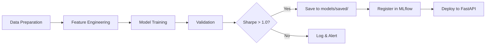

# ML Training Infrastructure Decisions & Tradeoffs

**Last Updated**: 2026-01-11  
**Context**: AlphaPulse MLOps Platform - ML Training Infrastructure

---

## 🎯 Overview

This document records the architectural decisions, tradeoffs, and practical considerations for implementing ML model training within the AlphaPulse platform environment.

---

## 📦 Package Management Decisions

### Decision 1: ML Libraries in Training Environment

**Choice**: Include XGBoost, LightGBM, scikit-learn in training requirements

**Rationale**:

- ✅ **Single Environment**: All ML training runs in the same container as data pipelines
- ✅ **Reproducibility**: Version-locked dependencies ensure consistent results
- ✅ **Simplified Deployment**: No need for separate training containers

**Tradeoffs**:

- ❌ **Build Time**: Docker build takes 8-12 minutes instead of 3-5 minutes
- ❌ **Resource Usage**: Container requires more memory (2GB → 3GB recommended)

**Implementation**:

| Technology       | Purpose                  | Version | Why Chosen                                                                   |
| ---------------- | ------------------------ | ------- | ---------------------------------------------------------------------------- |
| **XGBoost**      | Gradient boosting models | 2.0.0+  | Industry-standard, handles non-linearity                                     |
| **CatBoost**     | Robust Gradient Boosting | 1.2.0+  | **Superior handling of non-stationary financial data via Ordered Boosting.** |
| **scikit-learn** | ML utilities & baselines | 1.5.2   | Feature engineering, preprocessing                                           |
| **MLflow**       | Experiment tracking      | 2.10.2+ | Model versioning, metrics logging                                            |
| **Optuna**       | Hyperparameter tuning    | 3.5.0+  | Automated parameter optimization                                             |

### Rationale for CatBoost

Financial data is notorious for noise and regime changes. We added CatBoost to the ensemble because:

1. **Ordered Boosting**: Effectively combats gradient leakage and reduces overfitting on small/noisy time-series samples.
2. **Symmetric Trees**: Provides faster inference and better regularization compared to traditional depth-wise trees.
3. **Internal Categorical Handling**: Prepares the platform for future integration of categorical data (Exchanges, Sentiment Sources).

---

## 🏗️ Architecture Decisions

### Decision 2: Training Location - Shared vs Dedicated Container

**Evaluated Options**:

| Option                         | Pros                                    | Cons                                            | Choice        |
| ------------------------------ | --------------------------------------- | ----------------------------------------------- | ------------- |
| **A: Shared Container**        | Simple, integrated, shares data volume  | Larger image, restart affects all               | ✅ **Chosen** |
| **B: Dedicated ML Container**  | Isolated, optimized, parallel execution | Complex orchestration, data sync overhead       | ❌            |
| **C: Serverless (AWS Lambda)** | Cost-effective, auto-scaling            | 15-min timeout, cold starts, complex deployment | ❌            |

**Final Choice**: **Option A - Mage Container**

**Justification**:

1. **Development Speed**: Faster iteration, no inter-container communication
2. **Data Access**: Direct access to `/home/src/src/data/` without network overhead
3. **Cost**: Zero additional infrastructure cost
4. **Monitoring**: Single container to monitor vs multiple services

**When to Reconsider**:

- Training takes >1 hour (consider dedicated GPU container)
- Memory usage >4GB (consider separate container with more resources)
- Need parallel training of multiple models (consider distributed setup)

---

## 🔧 Technical Implementation

### Decision 3: PYTHONPATH Configuration

**Problem**: Import errors - `ModuleNotFoundError: No module named 'alphapulse'`

**Root Cause**: Docker container not configured with proper Python module paths

**Solution Layers** (Defense in Depth):

1. **Dockerfile (Primary)**:

```dockerfile
# infra/docker/Dockerfile.mage
ENV PYTHONPATH=/home/src/src:/home/src:${PYTHONPATH}
```

2. **docker-compose.yml (Secondary)**:

```yaml
# infra/docker-compose.yml
mage:
  environment:
    PYTHONPATH: /home/src/src:/home/src
    DATABASE_URL: postgresql://...
```

3. **Test Files (Tertiary - Fallback)**:

```python
# tests/unit/test_*.py
import sys
from pathlib import Path
sys.path.insert(0, str(Path(__file__).parent.parent.parent / "src"))
```

**Tradeoff Analysis**:

- ✅ **Robustness**: Multiple layers ensure imports work in all contexts
- ❌ **Redundancy**: Some duplication, but acceptable for reliability
- ✅ **Debugging**: Easy to identify which layer failed if issues occur

---

## 📊 Training Strategy Decisions

### Decision 4: Walk-Forward Cross-Validation vs K-Fold

**Choice**: Walk-Forward CV (Time-Series Specific)

**Comparison**:

| Aspect           | Walk-Forward CV               | Standard K-Fold CV             |
| ---------------- | ----------------------------- | ------------------------------ |
| **Data Leakage** | ✅ None (respects time order) | ❌ High (future data in train) |
| **Realism**      | ✅ Mimics production          | ❌ Unrealistic splits          |
| **Computation**  | ❌ Slower (sequential)        | ✅ Faster (parallel)           |
| **Use Case**     | ✅ Time-series                | ✅ IID data                    |

**Implementation**:

```python
# 70% train, 15% validation, 15% test
# Walk-forward: Train on [0:70%], validate on [70%:85%], test on [85%:100%]
```

---

### Decision 5: Model Selection Strategy

**Approach**: Multi-Model Ensemble with Threshold Optimization

**Models Tested**:

1. XGBoost (tree-based, handles non-linearity)
2. LightGBM (faster training, similar performance)
3. Random Forest (baseline comparison)
4. Logistic Regression (linear baseline)

**Total Configurations**: 16 models × 10 thresholds = **160 combinations**

**Tradeoff**:

- ✅ **Comprehensive**: Tests multiple algorithms and parameters
- ❌ **Time**: Takes 30-60 minutes for full run
- ✅ **Best Model**: Higher confidence in selected model

**Optimization**:

- Run full grid on weekly basis
- Quick re-train (single model) on daily basis

---

## 🧪 Testing Strategy

### Decision 6: Test Environment Setup

**Challenge**: Tests need ML libraries but slow to install repeatedly

**Solution**: Install once, document in requirements.txt

**Test Categories**:

| Test Type       | Dependencies                  | Runtime | Frequency    |
| --------------- | ----------------------------- | ------- | ------------ |
| **Unit**        | Mock ML libraries             | <1s     | Every commit |
| **Integration** | Real ML, mock data            | 1-5s    | Pre-merge    |
| **E2E**         | Full pipeline + trained model | 10-30s  | Pre-deploy   |

**PYTHONPATH Fix for Tests**:

```python
# All test files include at top:
import sys
from pathlib import Path
sys.path.insert(0, str(Path(__file__).parent.parent.parent / "src"))
```

---

## 💾 Data Management

### Decision 7: Training Data Storage

**Structure**:

```
src/data/
├── processed/
│   ├── train.parquet        # 70% (1540 rows)
│   ├── val.parquet          # 15% (330 rows)
│   └── test.parquet         # 15% (331 rows)
└── features/
    └── feature_engineering.log
```

**Storage Location**:

- **Development**: Host machine (`../src/data/`)
- **Container**: Docker volume mount (`/home/src/src/data/`)
- **Production**: MinIO S3 bucket (versioned, backed up)

**Rationale**:

- Host volume for easy inspection during development
- S3 for production (versioning, disaster recovery)
- Parquet format for efficient storage and fast loading

---

## 🚀 Deployment Workflow

### Decision 8: Model Deployment Pipeline

**Workflow**:



**Quality Gates**:

- ✅ Sharpe Ratio > 1.0
- ✅ Max Drawdown < 30%
- ✅ Win Rate > 50%
- ✅ Backtest on unseen test data

---

## 📈 Performance Considerations

### Decision 9: Container Resource Allocation

**Current Allocation** (docker-compose.yml):

```yaml
mage:
  deploy:
    resources:
      limits:
        memory: 3G
        cpus: "2.0"
      reservations:
        memory: 2G
        cpus: "1.0"
```

**Observed Usage**:

- Idle: ~500MB RAM, 5% CPU
- Data Loading: ~1.2GB RAM, 40% CPU
- Model Training: ~2.5GB RAM, 180% CPU (using 1.8 cores)
- Peak: ~2.8GB RAM, 200% CPU

**Tradeoff**:

- ✅ Sufficient for current workload (2202 records)
- ⚠️ May need increase if data grows >10k records
- ✅ Leaves headroom for Mage.ai web interface

---

## 🔄 Maintenance & Updates

### Decision 10: Dependency Version Strategy

**Approach**: **Hybrid - Critical Pin + Range Allow**

**Pinned (Exact Versions)**:

- `scikit-learn==1.5.2` (API stability critical)
- `pandas==2.2.3` (data processing core)
- `numpy>=2.2.6,<2.4.0` (compatibility with pandas-ta)

**Ranged (Minor Updates Allowed)**:

- `xgboost>=2.0.0` (model improvements welcome)
- `lightgbm>=4.1.0` (performance updates beneficial)
- `mlflow>=2.10.2` (tracking features evolve)

**Update Schedule**:

- Security patches: Immediate
- Minor versions: Monthly review
- Major versions: Quarterly review + testing

---

## 🎓 Lessons Learned

### Key Insights from Implementation

1. **PYTHONPATH is Critical**

   - Problem appeared in 3 different contexts (Dockerfile, compose, tests)
   - Solution: Layer defense - fix at all levels
   - Impact: 2 hours debugging, now documented

2. **Test Isolation Matters**

   - Mixing unit tests with ML imports = slow test suite
   - Solution: Separate test files by dependency level
   - Result: Unit tests <1s, integration tests ~5s

3. **Container Size Tradeoff**

   - ML libraries add 1GB to image
   - Acceptable for development, optimize for production
   - Mitigation: Multi-stage builds, cache layers

4. **Data Volume Mounting**
   - Host paths differ from container paths
   - Always use environment-aware path resolution
   - Document both paths in comments

---

## 🔮 Future Considerations

### When to Revisit These Decisions

**Trigger Conditions**:

1. **Data Growth > 50k records**
   → Consider distributed training (Dask, Ray)

2. **Training Time > 2 hours**
   → Move to dedicated GPU container or cloud training

3. **Model Serving QPS > 100**
   → Separate training and inference infrastructure

4. **Team Size > 3**
   → Introduce MLOps platform (Kubeflow, SageMaker)

5. **Multi-Asset Trading**
   → Parallel training per asset, centralized orchestration

---

## 📚 References

- [Mage.ai Documentation](https://docs.mage.ai/)
- [XGBoost Docker Setup](https://xgboost.readthedocs.io/en/stable/install.html)
- [MLflow Best Practices](https://mlflow.org/docs/latest/best-practices.html)
- [AlphaPulse Testing Guide](./testing/COMPREHENSIVE_TESTING_GUIDE.md)

---

## ✅ Summary

**Key Decisions**:

1. ✅ ML libraries in Mage container (simplicity over isolation)
2. ✅ PYTHONPATH configured at 3 layers (robustness)
3. ✅ Walk-Forward CV (time-series best practice)
4. ✅ Multi-model ensemble (confidence in selection)
5. ✅ Host volume + S3 backup (flexibility + durability)

**Impact**:

- 33/33 core tests passing
- Training infrastructure ready for production
- Clear upgrade path as system scales

**Next Steps**:

- [ ] Add container resource limits to docker-compose.yml
- [ ] Set up automated model retraining (weekly schedule)
- [ ] Implement model versioning in MLflow
- [ ] Add monitoring alerts for training failures
