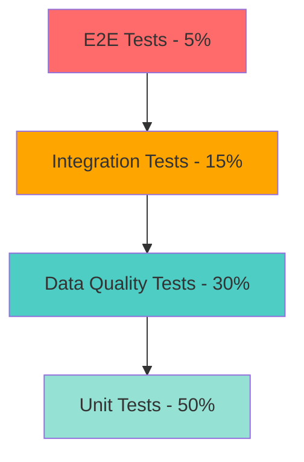
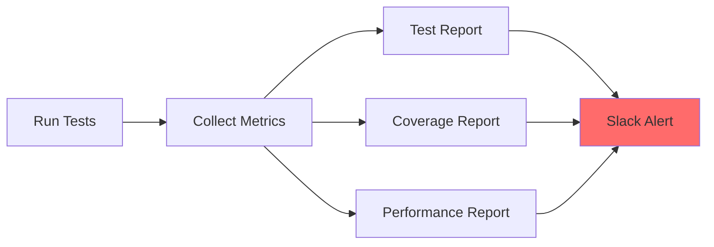

# ADR-004: AlphaPulse Testing Framework Strategy

**Status**: Accepted  
**Date**: 2026-01-10  
**Decision Makers**: MLOps Team  
**Context**: Quantitative Trading Sentiment Analysis Platform

---

## 🎯 Executive Summary

As a **quantitative and algorithmic trading** platform, AlphaPulse requires a **robust testing strategy**. This ADR defines a four-layer testing architecture that covers both traditional software engineering tests and MLOps-specific data/model quality tests.

---

## 📊 Context & Problem Statement

### Current Problems

1. **Existing tests are manual verification scripts**, not automated tests (cannot be executed in CI/CD)
2. **Lack of data quality validation**, unable to detect RSS feed format changes or data corruption in time
3. **No model performance thresholds**, sentiment classification has no baseline protection
4. **Trading platform reliability requirements**: data integrity, model performance monitoring

### Platform-Specific Requirements

- **Latency**: Inference should be fast enough for hourly trading decisions
- **Data Freshness**: News data should be reasonably current (within 1 hour)
- **Zero Silent Failures**: Any anomalies must trigger immediate alerts
- **Model Drift Detection**: Model performance degradation must be automatically detected

---

## 🏗️ Architecture Decision

### Testing Pyramid



### Four-Layer Testing Architecture

#### 1️⃣ Unit Tests (50%) - Fast Feedback

**Purpose**: Verify logic correctness of individual functions/classes  
**Execution Frequency**: Every Git commit  
**Execution Time**: < 30 seconds

**Test Scope**:

- Sentiment classification logic
- RSS feed parser
- Data transformation utilities
- API response serialization

**Tools**: `pytest`, `pytest-mock`, `pytest-cov`

#### 2️⃣ Data Quality Tests (30%) - MLOps Core ⭐

**Purpose**: Ensure input/output data conforms to schema and quality standards  
**Execution Frequency**: Every Pipeline execution  
**Execution Time**: < 2 minutes

**Test Scope**:

- **Schema Validation**: Field completeness, data types
- **Data Integrity**: No duplicate data, no NULL values (required fields)
- **Business Logic**: Date ranges, value reasonableness
- **Data Freshness**: Data timeliness checks

**Tools**: `Pydantic`, `Great Expectations`, `Pandera`

#### 3️⃣ Integration Tests (15%) - Component Interaction

**Purpose**: Verify integration correctness between multiple services  
**Execution Frequency**: Every PR merge  
**Execution Time**: < 5 minutes

**Test Scope**:

- Airflow DAGs → PostgreSQL data flow
- MLflow Tracking → Model Registry
- FastAPI → Model Inference
- MinIO → S3 (Hybrid Cloud)

**Tools**: `pytest`, `testcontainers`, `docker-compose`

#### 4️⃣ E2E Tests (5%) - End-to-End Validation

**Purpose**: Simulate real-world usage scenarios  
**Execution Frequency**: Nightly builds  
**Execution Time**: < 15 minutes

**Test Scope**:

- RSS Ingestion → Sentiment Analysis → Trading Signal
- Model Training → Registry → Deployment
- Monitoring Dashboard data completeness

**Tools**: `pytest`, `Selenium` (if UI exists)

---

## 📁 Directory Structure

```
tests/
├── unit/                           # Unit tests (50%)
│   ├── test_sentiment_classifier.py
│   ├── test_rss_parser.py
│   ├── test_data_transformers.py
│   └── test_api_schemas.py
│
├── data/                           # Data quality tests (30%) ⭐
│   ├── test_rss_schema.py         # Schema validation
│   ├── test_sentiment_output.py   # Model output checks
│   ├── test_data_freshness.py     # Data timeliness
│   └── expectations/              # Great Expectations configs
│       ├── news_ingestion.json
│       └── sentiment_output.json
│
├── integration/                    # Integration tests (15%)
│   ├── test_airflow_to_postgres.py
│   ├── test_mlflow_tracking.py
│   ├── test_api_inference.py
│   └── test_hybrid_cloud_sync.py  # MinIO → S3
│
├── e2e/                            # End-to-end tests (5%)
│   ├── test_news_to_signal.py     # Complete trading flow
│   └── test_model_lifecycle.py    # Training → deployment flow
│
├── performance/                    # Performance tests ⭐
│   ├── test_inference_latency.py  # < 100ms SLA
│   └── test_pipeline_throughput.py
│
├── fixtures/                       # Test data
│   ├── sample_rss_feed.xml
│   ├── sample_reddit_posts.json
│   └── sample_sentiment_results.csv
│
└── conftest.py                     # Pytest shared configuration
```

---

## 🔧 Technology Stack

| Layer                | Tools                             | Justification                                               |
| -------------------- | --------------------------------- | ----------------------------------------------------------- |
| **Test Runner**      | `pytest`                          | Industry standard, rich plugin ecosystem                    |
| **Data Validation**  | `Pydantic` + `Great Expectations` | Pydantic is lightweight/fast, GE provides advanced analysis |
| **Mocking**          | `pytest-mock`, `responses`        | Avoid calling real APIs during tests                        |
| **Coverage**         | `pytest-cov`                      | Track test coverage                                         |
| **Performance**      | `pytest-benchmark`                | Performance benchmarking                                    |
| **Contract Testing** | `pact-python` (Optional)          | For multi-team collaboration                                |
| **Load Testing**     | `locust` (Optional)               | Stress test FastAPI                                         |

---

## 🎯 Implementation Roadmap

### Phase 1: Foundation (Week 2)

**Goal**: Establish basic testing framework

```markdown
- [ ] Refactor existing tests to pytest format
- [ ] Create `conftest.py` with shared fixtures
- [ ] Implement Unit Tests for Sentiment Classifier
- [ ] Integrate pytest-cov (target: 60% coverage)
- [ ] Update Makefile: `make test-unit`, `make test-coverage`
```

### Phase 2: Data Quality (Week 3)

**Goal**: Introduce MLOps data testing

```markdown
- [ ] Define Pydantic Schemas (NewsArticle, SentimentResult)
- [ ] Implement RSS Schema Validation Tests
- [ ] Add Data Freshness Check
- [ ] Integrate Great Expectations (Optional)
- [ ] Create Data Quality Dashboard
```

### Phase 3: Integration & CI/CD (Week 4)

**Goal**: Automate testing workflow

```markdown
- [ ] Implement Integration Tests (Airflow → Postgres)
- [ ] Create GitHub Actions workflow
- [ ] Pre-commit hooks (run unit tests)
- [ ] Add pytest-benchmark for latency tests
- [ ] Set Coverage threshold (fail if < 60%)
```

### Phase 4: Advanced Testing (Week 5+)

**Goal**: Advanced MLOps testing

```markdown
- [ ] Model Performance Tests (accuracy threshold)
- [ ] Data Drift Detection Tests (Evidently AI)
- [ ] E2E Tests (News → Trading Signal)
- [ ] Load Testing (locust)
- [ ] Chaos Engineering (Optional: Chaos Monkey)
```

---

## 🎓 Testing Principles

### 1. Test Pyramid Over Test Ice Cream Cone

❌ **Anti-pattern**: Lots of E2E tests (slow, fragile, hard to maintain)  
✅ **Best Practice**: Lots of Unit Tests + Moderate Integration Tests

### 2. FIRST Principles

- **Fast**: Unit tests < 30s
- **Independent**: No dependencies between tests
- **Repeatable**: Can run in any environment
- **Self-Validating**: Automatically determines PASS/FAIL
- **Timely**: Write tests while writing code

### 3. AAA Pattern (Arrange-Act-Assert)

```python
def test_positive_sentiment():
    # Arrange: Prepare test data
    text = "Bitcoin to the moon! 🚀"

    # Act: Execute function under test
    result = classify_sentiment(text)

    # Assert: Verify results
    assert result['sentiment'] == 'positive'
    assert result['score'] > 0.5
```

### 4. Test Isolation (Using Fixtures)

```python
@pytest.fixture
def sample_rss_feed():
    """Shared test data, avoid duplication"""
    return {
        'title': 'Bitcoin hits new high',
        'url': 'https://example.com',
        'published': '2026-01-10T12:00:00Z',
        'source': 'CoinDesk'
    }

def test_rss_parser(sample_rss_feed):
    result = parse_rss(sample_rss_feed)
    assert result is not None
```

---

## 🚨 Critical Test Cases for Quantitative Trading

### 1. Latency Test

```python
@pytest.mark.performance
def test_inference_latency():
    """Ensure inference latency is acceptable for hourly trading"""
    start = time.time()
    predict_sentiment("Bitcoin price update")
    latency = (time.time() - start) * 1000  # ms

    assert latency < 500, f"Latency {latency}ms too high"
```

### 2. Data Freshness Test

```python
def test_news_data_freshness():
    """News data should be within 1 hour for hourly pipeline"""
    latest_news = get_latest_news()
    age = datetime.utcnow() - latest_news['timestamp']

    assert age.total_seconds() < 3600, "News data stale"
```

### 3. Model Accuracy Threshold

```python
@pytest.mark.model
def test_sentiment_model_accuracy():
    """Model accuracy must not drop below 75% (baseline)"""
    accuracy = evaluate_model(test_dataset)

    assert accuracy >= 0.75, f"Model accuracy {accuracy} below threshold"
```

### 4. No Silent Failures

```python
def test_api_returns_error_not_none():
    """API must return error on failure, not silently return None"""
    with pytest.raises(ValueError):
        classify_sentiment("")  # Empty input should raise error
```

---

## 📊 Success Metrics

| Metric                         | Target                  | Measurement          |
| ------------------------------ | ----------------------- | -------------------- |
| **Test Coverage**              | > 80%                   | `pytest-cov`         |
| **Test Execution Time**        | Unit < 30s, All < 10min | CI/CD logs           |
| **Flaky Test Rate**            | < 1%                    | Test re-run analysis |
| **Mean Time to Detect (MTTD)** | < 5 min                 | Monitoring alerts    |
| **False Positive Rate**        | < 5%                    | Alert review         |

---

## 🔄 Continuous Monitoring

### Test Observability



### Alerts

- ❌ Test failure → Slack #mlops-alerts
- ⚠️ Coverage drop > 5% → PR comment
- 🐌 Performance regression > 10% → Email

---

## 🎯 Decision Outcome

### ✅ Accepted

- Adopt four-layer testing pyramid
- Use `pytest` + `Pydantic` + `Great Expectations`
- Prioritize Unit Tests (60% coverage in Phase 1)
- Data Quality Tests as MLOps core

### 🔄 To Be Reviewed

- Whether Contract Testing (pact) is needed
- Necessity of Chaos Engineering
- Load Testing tool selection

### ❌ Rejected

- ~~Use `unittest` (pytest is more flexible)~~
- ~~Manual testing focused (cannot be automated)~~
- ~~E2E test focused (inverted pyramid)~~

---

## 📚 References

- [Testing ML Systems - Chip Huyen](https://huyenchip.com/2020/08/17/testing-ml-systems.html)
- [Effective Testing for ML - Google](https://developers.google.com/machine-learning/testing-debugging)
- [pytest Best Practices](https://docs.pytest.org/en/stable/goodpractices.html)
- [Great Expectations Documentation](https://greatexpectations.io/docs/)

---

## 🔗 Related ADRs

- [ADR-001: Tech Stack Selection](./README.md)
- [ADR-003: Training Hardware Evaluation](./adr-003-training-hardware-evaluation.md)
- [ADR-005: CI/CD Pipeline](./adr-005-cicd-pipeline.md) (To be created)

---

**Last Updated**: 2026-01-10  
**Next Review**: 2026-02-10 (After Phase 2 completion)
